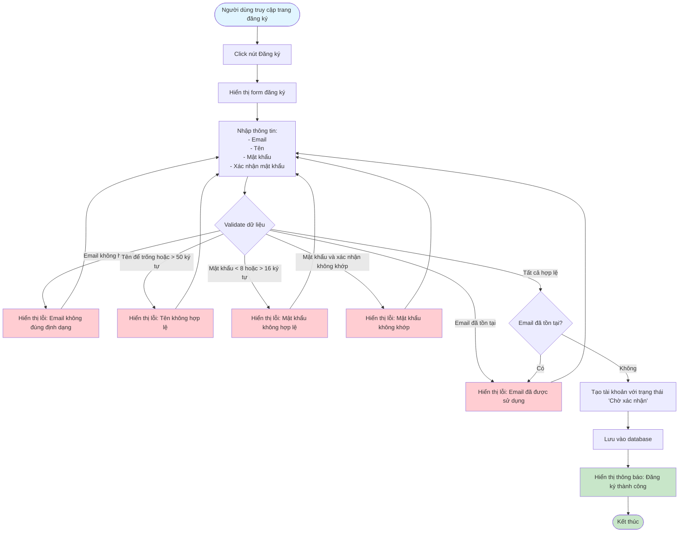

# Feature 2.1.1: Đăng Ký (Registration)

## Mô tả
Tính năng cho phép người dùng mới đăng ký tài khoản trong hệ thống.

## Actor
Mọi người (không cần đăng nhập)

## Flowchart

## Validation Rules
- **Email:** Định dạng email hợp lệ
- **Tên:** Không được để trống, tối đa 50 ký tự
- **Mật khẩu:** Không được để trống, tối thiểu 8 ký tự, tối đa 16 ký tự
- **Xác nhận mật khẩu:** Không được để trống, phải trùng với mật khẩu

## Edge Cases
- Email đã tồn tại trong hệ thống
- Mật khẩu quá yếu (có thể thêm validation)
- Mạng lỗi khi lưu dữ liệu

