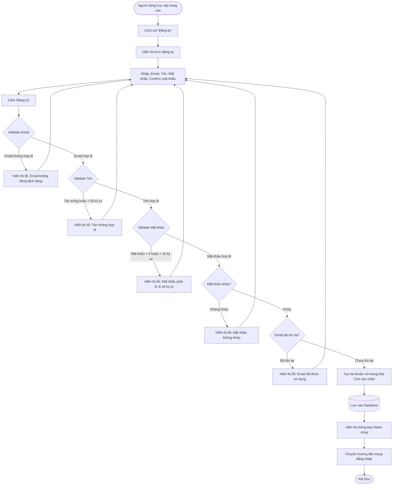

# Feature 2.1.1: Đăng Ký

## Mô tả
Cho phép người dùng mới tạo tài khoản trong hệ thống quản lý thư viện.

## Actor
Mọi người (không cần đăng nhập)

## Yêu cầu
Không có

## Flowchart



## Validation Rules

| Field | Rule | Message Error |
|-------|------|---------------|
| Email | Định dạng email hợp lệ | "Email không đúng định dạng" |
| Email | Email chưa tồn tại | "Email đã được sử dụng" |
| Tên | Không được để trống | "Tên không được để trống" |
| Tên | Tối đa 50 ký tự | "Tên không được vượt quá 50 ký tự" |
| Mật khẩu | Không được để trống | "Mật khẩu không được để trống" |
| Mật khẩu | Tối thiểu 8 ký tự, tối đa 16 ký tự | "Mật khẩu phải từ 8-16 ký tự" |
| Confirm mật khẩu | Phải trùng với mật khẩu | "Mật khẩu không khớp" |

## Data Model
```json
{
  "email": "string (unique)",
  "name": "string (max 50)",
  "password": "string (hashed, 8-16 chars)",
  "status": "Chờ xác nhận",
  "role": "Reader (default)",
  "created_at": "timestamp"
}
```

## Notes
- Mật khẩu được hash trước khi lưu vào database
- Tài khoản mới tạo mặc định có vai trò "Reader" và trạng thái "Chờ xác nhận"
- Admin có thể kích hoạt tài khoản sau đó

