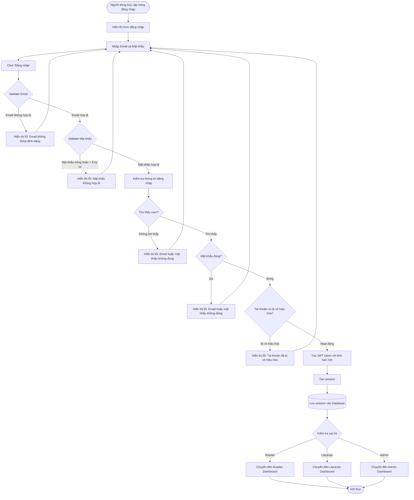

# Feature 2.1.2: Đăng Nhập

## Mô tả
Cho phép người dùng đã có tài khoản đăng nhập vào hệ thống.

## Actor
Mọi người (có tài khoản)

## Yêu cầu
Đã có tài khoản (Feature 2.1.1)

## Flowchart



## Validation Rules

| Field | Rule | Message Error |
|-------|------|---------------|
| Email | Định dạng email hợp lệ | "Email không đúng định dạng" |
| Email | Email tồn tại trong hệ thống | "Email hoặc mật khẩu không đúng" |
| Mật khẩu | Không được để trống | "Mật khẩu không được để trống" |
| Mật khẩu | Tối thiểu 8 ký tự, tối đa 16 ký tự | "Mật khẩu phải từ 8-16 ký tự" |
| Mật khẩu | Mật khẩu khớp với email | "Email hoặc mật khẩu không đúng" |
| Tài khoản | Tài khoản không bị vô hiệu hóa | "Tài khoản đã bị vô hiệu hóa" |

## Session Data
```json
{
  "token": "JWT token string",
  "user_id": "string",
  "email": "string",
  "name": "string",
  "role": "Reader|Librarian|Admin",
  "expires_at": "timestamp (24h from login)",
  "created_at": "timestamp"
}
```

## Notes
- Token có thời hạn 24 giờ
- Sau khi hết hạn, người dùng cần đăng nhập lại
- Mật khẩu được hash và so sánh với hash trong database
- Không hiển thị chi tiết lỗi cụ thể (email sai hay mật khẩu sai) để bảo mật

