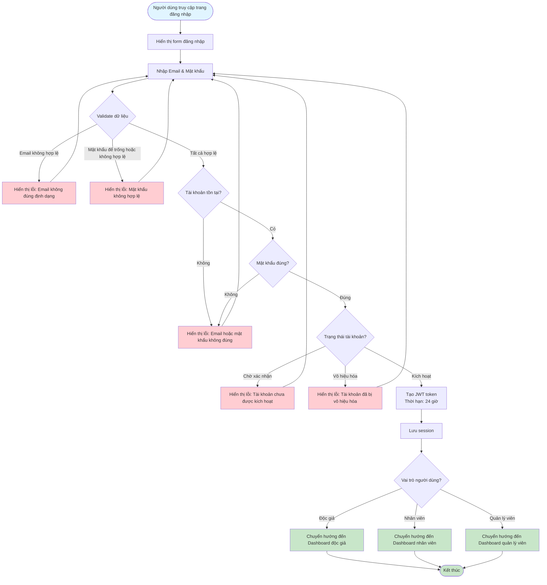

# Feature 2.1.2: Đăng Nhập (Login)

## Mô tả
Tính năng cho phép người dùng đăng nhập vào hệ thống với email và mật khẩu.

## Actor
Mọi người (không cần đăng nhập)

## Phụ thuộc
- 2.1.1 (Cần có tài khoản để đăng nhập)

## Flowchart

## Validation Rules
- **Email:** Định dạng email hợp lệ
- **Mật khẩu:** Không được để trống, tối thiểu 8 ký tự, tối đa 16 ký tự

## Edge Cases
- Email không tồn tại trong hệ thống
- Mật khẩu sai
- Tài khoản chưa được kích hoạt
- Tài khoản bị vô hiệu hóa
- Token hết hạn (sau 24 giờ)

