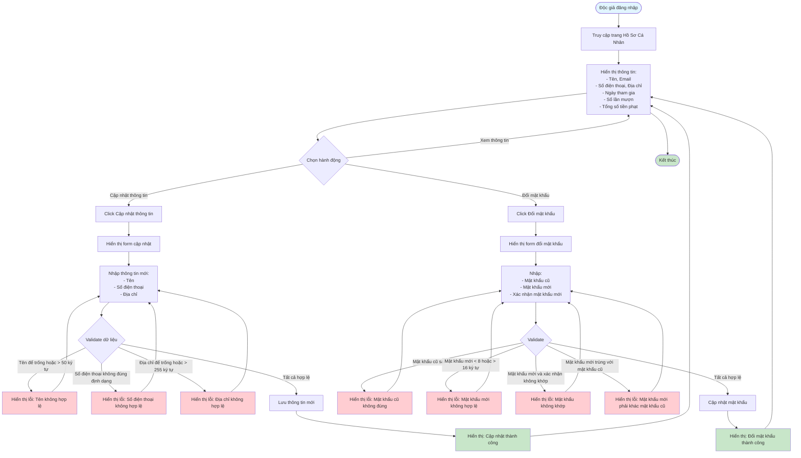

# Feature 2.1.3: Hồ Sơ Cá Nhân (Personal Profile)

## Mô tả
Tính năng cho phép độc giả xem và cập nhật thông tin cá nhân, đổi mật khẩu.

## Actor
Độc giả

## Phụ thuộc
- 2.1.2 (Cần đăng nhập)

## Flowchart

## Validation Rules
- **Tên:** Không được để trống, tối đa 50 ký tự
- **Số điện thoại:** Định dạng số điện thoại hợp lệ
- **Địa chỉ:** Không được để trống, tối đa 255 ký tự
- **Mật khẩu cũ:** Phải đúng với mật khẩu hiện tại
- **Mật khẩu mới:** Tối thiểu 8 ký tự, tối đa 16 ký tự, phải khác mật khẩu cũ

## Edge Cases
- Số điện thoại không đúng định dạng
- Địa chỉ quá dài
- Mật khẩu mới trùng với mật khẩu cũ
- Mất kết nối khi lưu dữ liệu

