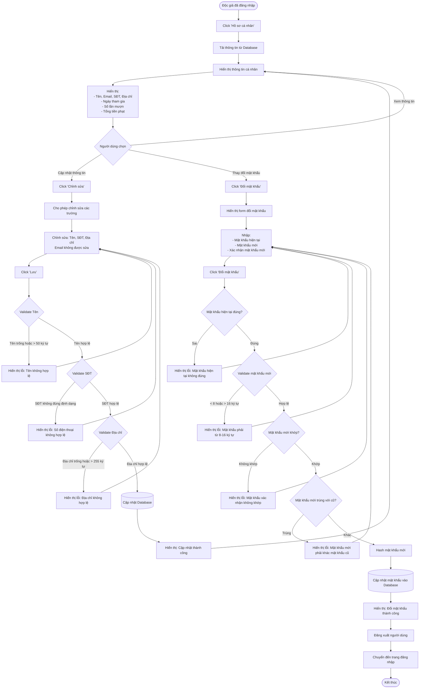

# Feature 2.1.3: Hồ Sơ Cá Nhân

## Mô tả
Cho phép độc giả xem và cập nhật thông tin cá nhân, thay đổi mật khẩu.

## Actor
Độc giả (đã đăng nhập)

## Yêu cầu
- Đã đăng nhập (Feature 2.1.2)
- Có vai trò Reader

## Flowchart



## Validation Rules

### Cập nhật thông tin cá nhân

| Field | Rule | Message Error |
|-------|------|---------------|
| Tên | Không được để trống | "Tên không được để trống" |
| Tên | Tối đa 50 ký tự | "Tên không được vượt quá 50 ký tự" |
| Số điện thoại | Định dạng số điện thoại hợp lệ | "Số điện thoại không đúng định dạng" |
| Địa chỉ | Không được để trống | "Địa chỉ không được để trống" |
| Địa chỉ | Tối đa 255 ký tự | "Địa chỉ không được vượt quá 255 ký tự" |

### Thay đổi mật khẩu

| Field | Rule | Message Error |
|-------|------|---------------|
| Mật khẩu hiện tại | Phải khớp với mật khẩu trong database | "Mật khẩu hiện tại không đúng" |
| Mật khẩu mới | Tối thiểu 8 ký tự, tối đa 16 ký tự | "Mật khẩu phải từ 8-16 ký tự" |
| Mật khẩu mới | Phải khác mật khẩu hiện tại | "Mật khẩu mới phải khác mật khẩu cũ" |
| Xác nhận mật khẩu mới | Phải trùng với mật khẩu mới | "Mật khẩu xác nhận không khớp" |

## Data Display
```json
{
  "name": "string",
  "email": "string (read-only)",
  "phone": "string",
  "address": "string",
  "joined_date": "date",
  "total_borrows": "number",
  "total_fines": "number (VND)"
}
```

## Notes
- Email không được phép chỉnh sửa
- Sau khi đổi mật khẩu, người dùng phải đăng nhập lại
- Số lần mượn và tổng tiền phạt chỉ hiển thị, không thể chỉnh sửa
- Các trường thống kê được tính toán từ database

