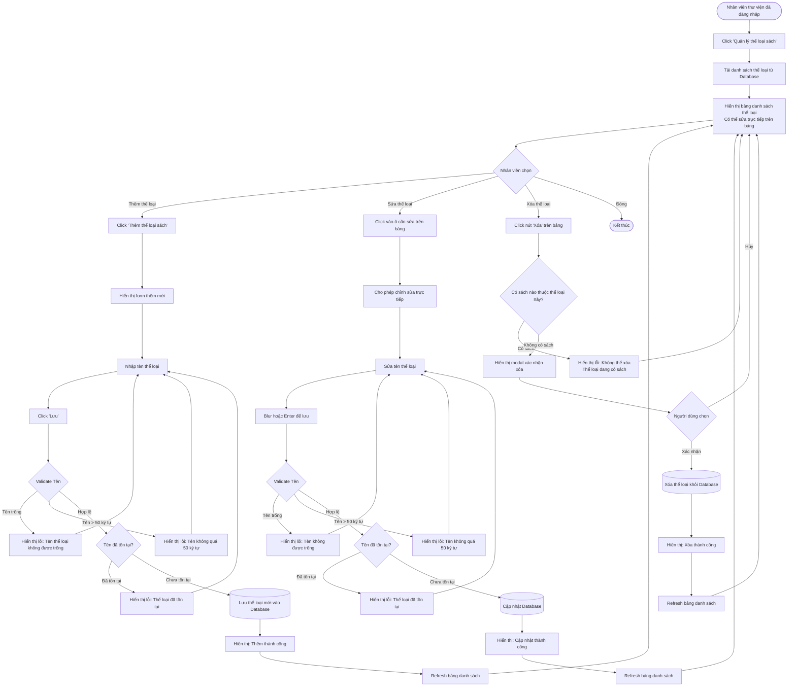

# Feature 2.2.1: Quản Lý Thể Loại Sách

## Mô tả
Cho phép nhân viên thư viện quản lý (xem, thêm, sửa, xóa) các thể loại sách trong hệ thống.

## Actor
Nhân viên thư viện

## Yêu cầu
- Đã đăng nhập (Feature 2.1.2)
- Có vai trò Librarian hoặc Admin

## Flowchart



## Validation Rules

| Operation | Field | Rule | Message Error |
|-----------|-------|------|---------------|
| Thêm/Sửa | Tên thể loại | Không được để trống | "Tên thể loại không được để trống" |
| Thêm/Sửa | Tên thể loại | Tối đa 50 ký tự | "Tên thể loại không được vượt quá 50 ký tự" |
| Thêm/Sửa | Tên thể loại | Phải unique | "Thể loại đã tồn tại" |
| Xóa | Thể loại | Không có sách nào thuộc thể loại | "Không thể xóa. Thể loại đang có sách" |

## Data Model
```json
{
  "id": "string (UUID)",
  "name": "string (max 50, unique)",
  "created_at": "timestamp",
  "updated_at": "timestamp",
  "books_count": "number (computed)"
}
```

## UI Features
- Bảng có thể sửa trực tiếp (inline editing)
- Hiển thị số lượng sách thuộc mỗi thể loại
- Có chức năng tìm kiếm/lọc thể loại
- Sắp xếp theo tên hoặc số lượng sách

## Notes
- Không thể xóa thể loại nếu còn sách thuộc thể loại đó
- Cần xác nhận trước khi xóa để tránh xóa nhầm
- Thể loại "Chưa phân loại" (mặc định) không được xóa

