# Feature 2.2.1: Quản lý thể loại sách (Book Category Management)

## Mô tả
Tính năng cho phép nhân viên thư viện quản lý các thể loại sách: xem, thêm, sửa, xóa.

## Actor
Nhân viên thư viện

## Phụ thuộc
- 2.1.2 (Cần đăng nhập với vai trò nhân viên)

## Flowchart

```mermaid
flowchart TD
    Start([Nhân viên đăng nhập]) --> AccessCategory[Truy cập trang Quản lý thể loại]
    AccessCategory --> DisplayList[Hiển thị bảng danh sách thể loại]
    
    DisplayList --> UserAction{Chọn hành động}
    
    UserAction -->|Thêm thể loại| AddCategory[Click Thêm thể loại sách]
    UserAction -->|Sửa thể loại| EditCategory[Click Sửa trên bảng]
    UserAction -->|Xóa thể loại| DeleteCategory[Click Xóa trên bảng]
    
    AddCategory --> ShowAddForm[Hiển thị form thêm thể loại]
    ShowAddForm --> InputName[Nhập tên thể loại]
    InputName --> ValidateAdd{Validate}
    
    ValidateAdd -->|Tên để trống| ErrorEmpty[Hiển thị lỗi: Tên không được để trống]
    ErrorEmpty --> InputName
    
    ValidateAdd -->|Tên > 50 ký tự| ErrorLong[Hiển thị lỗi: Tên quá dài]
    ErrorLong --> InputName
    
    ValidateAdd -->|Tên đã tồn tại| ErrorExists[Hiển thị lỗi: Tên thể loại đã tồn tại]
    ErrorExists --> InputName
    
    ValidateAdd -->|Tất cả hợp lệ| SaveAdd[Lưu thể loại mới]
    SaveAdd --> SuccessAdd[Hiển thị: Thêm thành công]
    SuccessAdd --> DisplayList
    
    EditCategory --> ShowEditForm[Hiển thị form sửa thể loại]
    ShowEditForm --> InputEdit[Nhập tên mới]
    InputEdit --> ValidateEdit{Validate}
    
    ValidateEdit -->|Tên để trống| ErrorEmpty
    ValidateEdit -->|Tên > 50 ký tự| ErrorLong
    ValidateEdit -->|Tên đã tồn tại| ErrorExists
    ValidateEdit -->|Tất cả hợp lệ| SaveEdit[Lưu thay đổi]
    SaveEdit --> SuccessEdit[Hiển thị: Sửa thành công]
    SuccessEdit --> DisplayList
    
    DeleteCategory --> CheckBooks{Có sách nào thuộc thể loại này?}
    CheckBooks -->|Có| ErrorHasBooks[Hiển thị lỗi: Không thể xóa vì có sách thuộc thể loại này]
    ErrorHasBooks --> DisplayList
    
    CheckBooks -->|Không| ConfirmDelete[Xác nhận xóa]
    ConfirmDelete --> UserConfirm{Người dùng xác nhận?}
    UserConfirm -->|Không| DisplayList
    UserConfirm -->|Có| DeleteDB[Xóa thể loại]
    DeleteDB --> SuccessDelete[Hiển thị: Xóa thành công]
    SuccessDelete --> DisplayList
    
    DisplayList --> End([Kết thúc])
    
    style Start fill:#e1f5ff
    style End fill:#c8e6c9
    style ErrorEmpty fill:#ffcdd2
    style ErrorLong fill:#ffcdd2
    style ErrorExists fill:#ffcdd2
    style ErrorHasBooks fill:#ffcdd2
    style SuccessAdd fill:#c8e6c9
    style SuccessEdit fill:#c8e6c9
    style SuccessDelete fill:#c8e6c9
```

## Validation Rules
- **Tên thể loại:** Không được để trống, tối đa 50 ký tự

## Edge Cases
- Tên thể loại để trống
- Tên thể loại quá dài (>50 ký tự)
- Tên thể loại trùng với thể loại khác
- Có sách thuộc thể loại → Không cho phép xóa
- Mất kết nối khi lưu dữ liệu

