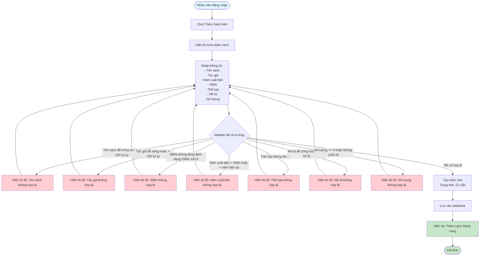

# Feature 2.2.2: Thêm Sách Mới (Add New Book)

## Mô tả
Tính năng cho phép nhân viên thư viện thêm sách mới vào hệ thống.

## Actor
Nhân viên thư viện

## Phụ thuộc
- 2.1.2 (Cần đăng nhập)
- 2.2.1 (Cần có thể loại sách)

## Flowchart

## Validation Rules
- **Tên sách:** Không được để trống, tối đa 100 ký tự
- **Tác giả:** Không được để trống, tối đa 100 ký tự
- **ISBN:** Định dạng chuẩn ISBN-10 hoặc ISBN-13 (nếu có)
- **Năm xuất bản:** Năm hợp lệ (1900 - năm hiện tại)
- **Thể loại:** Phải có thể loại sách (từ danh sách)
- **Mô tả:** Không được để trống, tối đa 255 ký tự
- **Số lượng:** Phải > 0, kiểu số

## Edge Cases
- ISBN không đúng định dạng (ISBN-10 hoặc ISBN-13)
- Năm xuất bản không hợp lệ (<1900 hoặc >năm hiện tại)
- Số lượng <= 0
- Thể loại không tồn tại
- ISBN đã tồn tại (có thể cho phép thêm bản sao hoặc cảnh báo)

