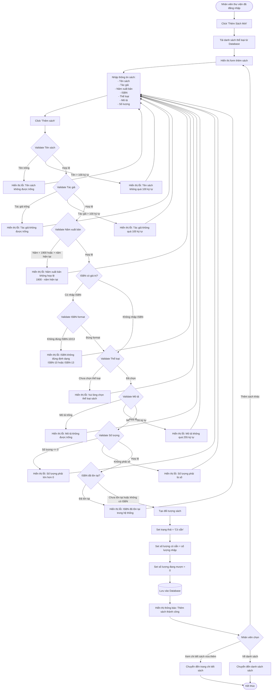

# Feature 2.2.2: Thêm Sách Mới

## Mô tả
Cho phép nhân viên thư viện thêm sách mới vào hệ thống.

## Actor
Nhân viên thư viện

## Yêu cầu
- Đã đăng nhập (Feature 2.1.2)
- Có vai trò Librarian hoặc Admin
- Đã có thể loại sách (Feature 2.2.1)

## Flowchart



## Validation Rules

| Field | Rule | Message Error |
|-------|------|---------------|
| Tên sách | Không được để trống | "Tên sách không được để trống" |
| Tên sách | Tối đa 100 ký tự | "Tên sách không được vượt quá 100 ký tự" |
| Tác giả | Không được để trống | "Tác giả không được để trống" |
| Tác giả | Tối đa 100 ký tự | "Tác giả không được vượt quá 100 ký tự" |
| Năm xuất bản | Từ 1900 đến năm hiện tại | "Năm xuất bản phải từ 1900 đến năm hiện tại" |
| ISBN | Định dạng ISBN-10 hoặc ISBN-13 (nếu có) | "ISBN không đúng định dạng" |
| ISBN | Không được trùng (unique) | "ISBN đã tồn tại trong hệ thống" |
| Thể loại | Phải chọn thể loại | "Vui lòng chọn thể loại sách" |
| Mô tả | Không được để trống | "Mô tả không được để trống" |
| Mô tả | Tối đa 255 ký tự | "Mô tả không được vượt quá 255 ký tự" |
| Số lượng | Phải > 0 | "Số lượng phải lớn hơn 0" |
| Số lượng | Kiểu số nguyên | "Số lượng phải là số" |

## Data Model
```json
{
  "id": "string (UUID)",
  "title": "string (max 100)",
  "author": "string (max 100)",
  "publication_year": "number (1900 - current year)",
  "isbn": "string (ISBN-10 or ISBN-13, nullable, unique)",
  "category_id": "string (foreign key)",
  "description": "string (max 255)",
  "total_quantity": "number (> 0)",
  "available_quantity": "number (= total_quantity initially)",
  "borrowed_quantity": "number (= 0 initially)",
  "status": "Có sẵn",
  "created_at": "timestamp",
  "updated_at": "timestamp"
}
```

## Notes
- ISBN là trường tùy chọn, nhưng nếu nhập thì phải đúng định dạng
- Sách mới thêm có trạng thái mặc định là "Có sẵn"
- Số lượng có sẵn ban đầu bằng tổng số lượng nhập
- Số lượng đang mượn ban đầu = 0
- Hệ thống tự động tính toán số lượng có sẵn khi có mượn/trả

