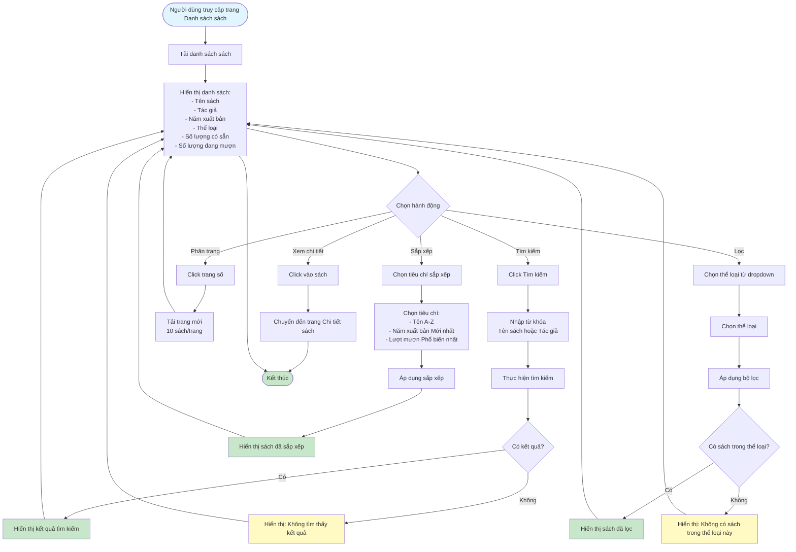

# Feature 2.2.3: Xem Danh Sách Sách (View Book List)

## Mô tả
Tính năng cho phép tất cả người dùng (không cần đăng nhập) xem danh sách sách với các chức năng tìm kiếm, lọc, sắp xếp.

## Actor
Tất cả người dùng (không cần login)

## Phụ thuộc
Không có

## Flowchart

## Chức năng
- **Tìm kiếm:** Theo tên sách hoặc tác giả
- **Lọc:** Theo thể loại
- **Sắp xếp:** 
  - Tên (A-Z)
  - Năm xuất bản (Mới nhất)
  - Lượt mượn (Phổ biến nhất)
- **Phân trang:** 10 sách trên 1 trang

## Edge Cases
- Không có kết quả tìm kiếm
- Không có sách nào trong thể loại được chọn
- Trang trống (không có sách)
- Kết hợp nhiều bộ lọc cùng lúc

