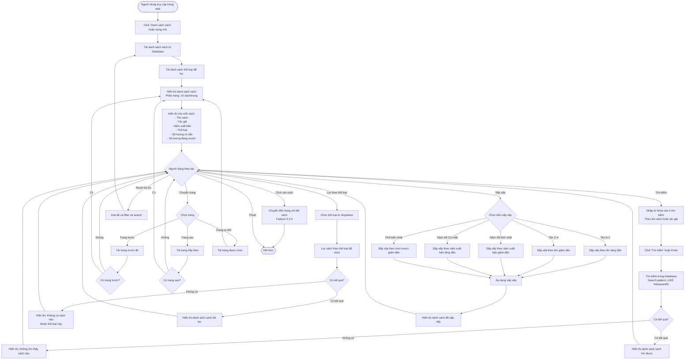

# Feature 2.2.3: Xem Danh Sách Sách

## Mô tả
Cho phép tất cả người dùng (kể cả chưa đăng nhập) xem danh sách sách trong thư viện với các tính năng tìm kiếm, lọc và sắp xếp.

## Actor
Tất cả người dùng (không cần đăng nhập)

## Yêu cầu
Không có (tính năng public)

## Flowchart



## Display Information

Mỗi sách trong danh sách hiển thị:

| Field | Description |
|-------|-------------|
| Hình ảnh | Thumbnail của sách (nếu có) |
| Tên sách | Tiêu đề sách |
| Tác giả | Tên tác giả |
| Năm xuất bản | Năm phát hành |
| Thể loại | Tên thể loại |
| Số lượng có sẵn | Số sách còn có thể mượn |
| Số lượng đang mượn | Số sách đang được mượn |
| Trạng thái | Badge: Có sẵn / Hết sách |

## Features

### 1. Tìm Kiếm
- Input: Text field
- Search trong: Tên sách, Tác giả
- Real-time search hoặc search on submit
- Hỗ trợ tìm kiếm không dấu

### 2. Lọc Theo Thể Loại
- Dropdown chọn thể loại
- Option "Tất cả thể loại" để bỏ lọc
- Hiển thị số lượng sách trong mỗi thể loại

### 3. Sắp Xếp
- Tên (A-Z)
- Tên (Z-A)
- Năm xuất bản (Mới nhất)
- Năm xuất bản (Cũ nhất)
- Lượt mượn (Phổ biến nhất)

### 4. Phân Trang
- 10 sách trên 1 trang
- Hiển thị: Trang hiện tại / Tổng số trang
- Navigation: Đầu, Trước, Số trang, Sau, Cuối

## Data Query
```sql
-- Example query structure
SELECT 
  id, title, author, publication_year, 
  category_name, available_quantity, 
  borrowed_quantity, borrow_count
FROM books
LEFT JOIN categories ON books.category_id = categories.id
WHERE 
  (title LIKE '%keyword%' OR author LIKE '%keyword%')
  AND (category_id = ? OR ? IS NULL)
ORDER BY 
  CASE 
    WHEN sort = 'name_asc' THEN title ASC
    WHEN sort = 'name_desc' THEN title DESC
    WHEN sort = 'year_desc' THEN publication_year DESC
    WHEN sort = 'popular' THEN borrow_count DESC
  END
LIMIT 10 OFFSET page_offset;
```

## UI Components
- Search bar (sticky top)
- Filter dropdown (Category)
- Sort dropdown
- Book grid/list view
- Pagination controls
- No result message

## Notes
- Tính năng này không yêu cầu đăng nhập
- Kết quả tìm kiếm có thể cache để tăng performance
- Hỗ trợ cả desktop và mobile responsive
- Loading state khi đang tải dữ liệu

