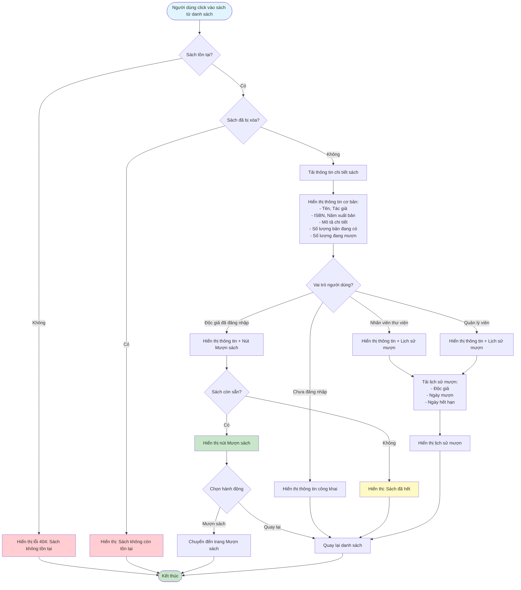

# Feature 2.2.4: Xem Chi Tiết Sách (View Book Details)

## Mô tả
Tính năng cho phép tất cả người dùng xem thông tin chi tiết của một cuốn sách.

## Actor
Tất cả người dùng (không cần login)

## Phụ thuộc
- 2.2.3 (Cần có danh sách sách trước)

## Flowchart

## Thông tin hiển thị
- **Tất cả người dùng:** Tên, Tác giả, ISBN, Năm xuất bản, Mô tả chi tiết, Số lượng có sẵn, Số lượng đang mượn
- **Nhân viên/Quản lý viên:** Thêm Lịch sử mượn (Độc giả, Ngày mượn, Ngày hết hạn)
- **Độc giả đã đăng nhập:** Thêm nút "Mượn sách" (nếu sách còn sẵn)

## Edge Cases
- Sách không tồn tại → 404
- Sách đã bị xóa → Thông báo sách không còn tồn tại
- Sách hết → Ẩn nút "Mượn sách"

