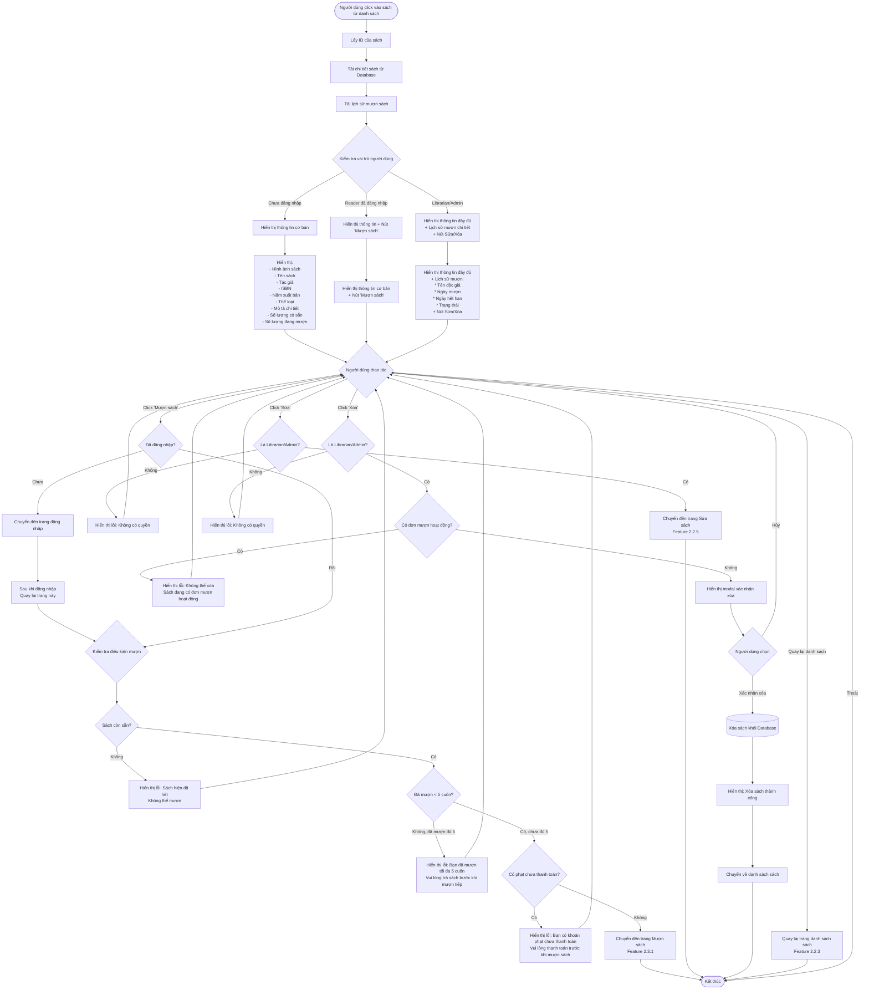

# Feature 2.2.4: Xem Chi Tiết Sách

## Mô tả
Cho phép tất cả người dùng xem thông tin chi tiết của một cuốn sách. Độc giả có thể mượn sách từ trang này.

## Actor
Tất cả người dùng (không cần đăng nhập để xem, cần đăng nhập để mượn)

## Yêu cầu
- Đã có danh sách sách (Feature 2.2.3)

## Flowchart



## Display Information

### Thông Tin Cơ Bản (Tất cả người dùng)
```json
{
  "book_image": "URL to image",
  "title": "string",
  "author": "string",
  "isbn": "string",
  "publication_year": "number",
  "category": "string",
  "description": "string (full)",
  "total_quantity": "number",
  "available_quantity": "number",
  "borrowed_quantity": "number",
  "borrow_count": "number (total times borrowed)",
  "status": "Có sẵn | Hết sách"
}
```

### Thông Tin Bổ Sung (Librarian/Admin)
```json
{
  "borrow_history": [
    {
      "reader_name": "string",
      "reader_email": "string",
      "borrow_date": "date",
      "due_date": "date",
      "return_date": "date (nullable)",
      "status": "Chờ xác nhận | Đang mượn | Quá hạn | Đã trả | Bị từ chối"
    }
  ]
}
```

## User Actions by Role

### Chưa Đăng Nhập
- Xem thông tin cơ bản
- Quay lại danh sách

### Reader (Đã Đăng Nhập)
- Xem thông tin cơ bản
- Click "Mượn sách" (nếu đủ điều kiện)
- Quay lại danh sách

### Librarian/Admin
- Xem thông tin đầy đủ + lịch sử
- Sửa thông tin sách
- Xóa sách (nếu không có đơn mượn)
- Quay lại danh sách

## Business Rules

### Điều Kiện Mượn Sách
1. ✅ Sách phải còn sẵn (available_quantity > 0)
2. ✅ Độc giả chưa mượn quá 5 cuốn
3. ✅ Độc giả không có khoản phạt chưa thanh toán

### Điều Kiện Xóa Sách
1. ✅ Không có đơn mượn ở trạng thái: "Chờ xác nhận", "Đang mượn", "Quá hạn"
2. ✅ Chỉ Librarian/Admin mới có quyền

## UI Components
- Book detail card với responsive layout
- Image gallery (nếu có nhiều ảnh)
- Availability badge (Có sẵn/Hết sách)
- Borrow button (conditional rendering)
- Edit/Delete buttons (staff only)
- Borrow history table (staff only)
- Breadcrumb navigation
- Related books recommendation (optional)

## Notes
- Nếu user chưa đăng nhập mà click "Mượn sách", redirect đến trang login và sau đó quay lại trang chi tiết
- Lịch sử mượn chỉ hiển thị cho nhân viên thư viện và admin
- Badge "Có sẵn" / "Hết sách" được cập nhật real-time
- Có thể thêm tính năng "Đặt trước" nếu sách hết (future enhancement)

