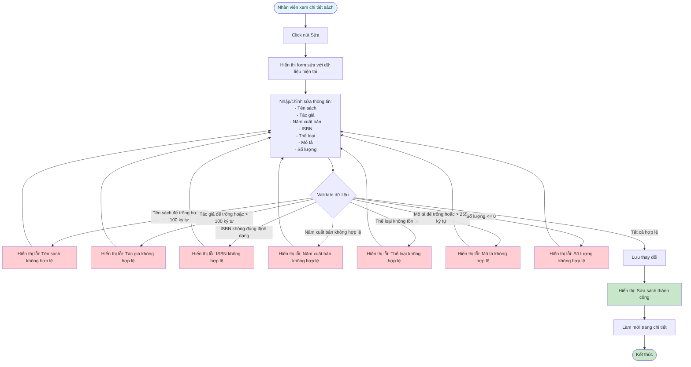
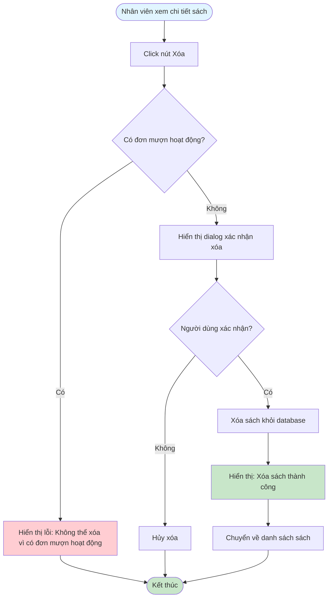

# Feature 2.2.5: Sửa & Xóa Sách (Edit & Delete Book)

## Mô tả
Tính năng cho phép nhân viên thư viện sửa và xóa sách trong hệ thống.

## Actor
Nhân viên thư viện

## Phụ thuộc
- 2.1.2 (Cần đăng nhập)
- 2.2.4 (Cần xem chi tiết sách)

## Flowchart - Sửa Sách

## Flowchart - Xóa Sách

## Validation Rules
- Tương tự như Feature 2.2.2 (Thêm Sách Mới)

## Edge Cases
- Sách đang được mượn → Không thể xóa
- Sách có đơn mượn chờ xác nhận → Có thể xóa hoặc không (tùy business logic)
- Mất kết nối khi lưu dữ liệu

