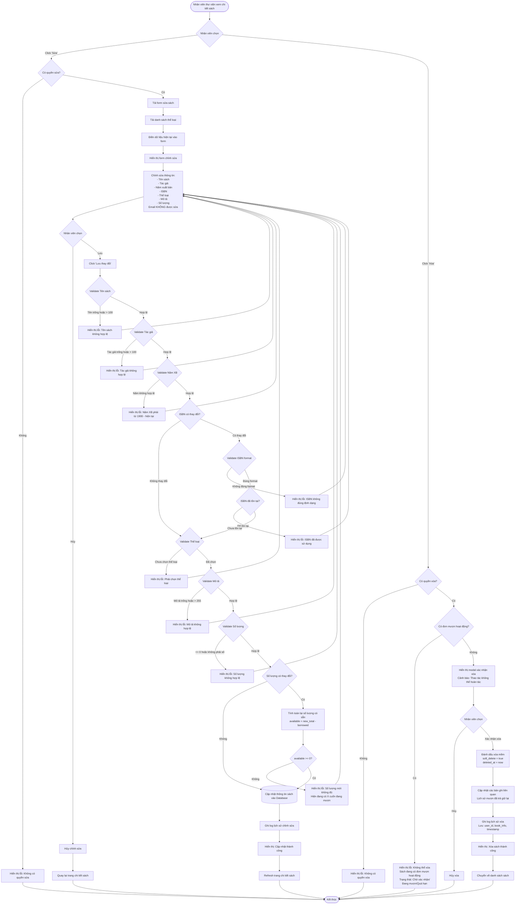

# Feature 2.2.5: Sửa & Xóa Sách

## Mô tả
Cho phép nhân viên thư viện chỉnh sửa thông tin sách hoặc xóa sách khỏi hệ thống.

## Actor
Nhân viên thư viện, Admin

## Yêu cầu
- Đã đăng nhập (Feature 2.1.2)
- Có vai trò Librarian hoặc Admin
- Sách đã tồn tại (Feature 2.2.4)

## Flowchart



## Validation Rules - Sửa Sách

| Field | Rule | Message Error |
|-------|------|---------------|
| Tên sách | Không được để trống | "Tên sách không được để trống" |
| Tên sách | Tối đa 100 ký tự | "Tên sách không được vượt quá 100 ký tự" |
| Tác giả | Không được để trống | "Tác giả không được để trống" |
| Tác giả | Tối đa 100 ký tự | "Tác giả không được vượt quá 100 ký tự" |
| Năm xuất bản | Từ 1900 đến năm hiện tại | "Năm xuất bản phải từ 1900 đến năm hiện tại" |
| ISBN | Định dạng ISBN-10 hoặc ISBN-13 (nếu có) | "ISBN không đúng định dạng" |
| ISBN | Không được trùng với sách khác | "ISBN đã được sử dụng" |
| Thể loại | Phải chọn thể loại | "Vui lòng chọn thể loại sách" |
| Mô tả | Không được để trống | "Mô tả không được để trống" |
| Mô tả | Tối đa 255 ký tự | "Mô tả không được vượt quá 255 ký tự" |
| Số lượng | Phải > 0 | "Số lượng phải lớn hơn 0" |
| Số lượng | Phải >= số lượng đang mượn | "Số lượng mới không đủ. Hiện có {borrowed_quantity} cuốn đang mượn" |
| Số lượng | Kiểu số nguyên | "Số lượng phải là số" |

## Business Rules - Xóa Sách

### Điều Kiện Xóa
1. ✅ Không có đơn mượn ở trạng thái "Chờ xác nhận"
2. ✅ Không có đơn mượn ở trạng thái "Đang mượn"
3. ✅ Không có đơn mượn ở trạng thái "Quá hạn"
4. ✅ Chỉ Librarian/Admin có quyền xóa

### Xóa Mềm (Soft Delete)
- Không xóa hẳn khỏi database
- Đánh dấu `soft_delete = true`
- Lưu `deleted_at` timestamp
- Các đơn mượn đã trả vẫn giữ lại trong lịch sử

## Data Update - Sửa Sách
```json
{
  "title": "string (max 100)",
  "author": "string (max 100)",
  "publication_year": "number (1900 - current)",
  "isbn": "string (ISBN-10/13, nullable, unique)",
  "category_id": "string (foreign key)",
  "description": "string (max 255)",
  "total_quantity": "number (> 0, >= borrowed_quantity)",
  "available_quantity": "number (calculated: total - borrowed)",
  "updated_at": "timestamp",
  "updated_by": "user_id"
}
```

## Data Update - Xóa Sách
```json
{
  "soft_delete": true,
  "deleted_at": "timestamp",
  "deleted_by": "user_id"
}
```

## Audit Log
Mỗi thao tác sửa/xóa cần ghi log:
```json
{
  "action": "update | delete",
  "book_id": "string",
  "book_title": "string",
  "user_id": "string",
  "user_name": "string",
  "changes": {
    "field_name": {
      "old_value": "value",
      "new_value": "value"
    }
  },
  "timestamp": "timestamp"
}
```

## Notes
- Số lượng mới phải >= số lượng đang mượn
- ISBN có thể để trống nhưng nếu nhập phải unique
- Xóa sách là soft delete để giữ lại dữ liệu lịch sử
- Cần xác nhận trước khi xóa
- Ghi log đầy đủ để audit trail

