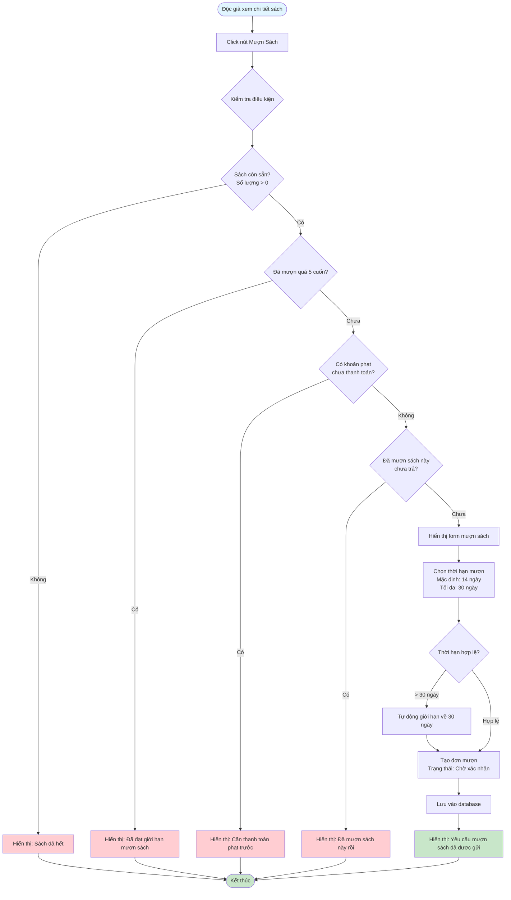

# Feature 2.3.1: Mượn Sách - Độc Giả (Borrow Book - Reader)

## Mô tả
Tính năng cho phép độc giả yêu cầu mượn sách từ hệ thống.

## Actor
Độc giả

## Phụ thuộc
- 2.1.2 (Cần đăng nhập)
- 2.2.4 (Cần xem chi tiết sách)

## Flowchart

## Điều kiện mượn sách
1. Sách còn sẵn (số lượng > 0)
2. Độc giả chưa vượt quá số sách mượn tối đa (mặc định 5 cuốn)
3. Không có khoản phạt chưa thanh toán
4. Chưa mượn sách này (đang mượn)

## Edge Cases
- Sách hết → Thông báo sách đã hết
- Đã mượn quá 5 cuốn → Thông báo đã đạt giới hạn
- Có phạt chưa thanh toán → Thông báo cần thanh toán phạt trước
- Đã mượn sách này rồi → Có thể ngăn chặn hoặc cho phép
- Thời hạn mượn > 30 ngày → Tự động giới hạn về 30 ngày

