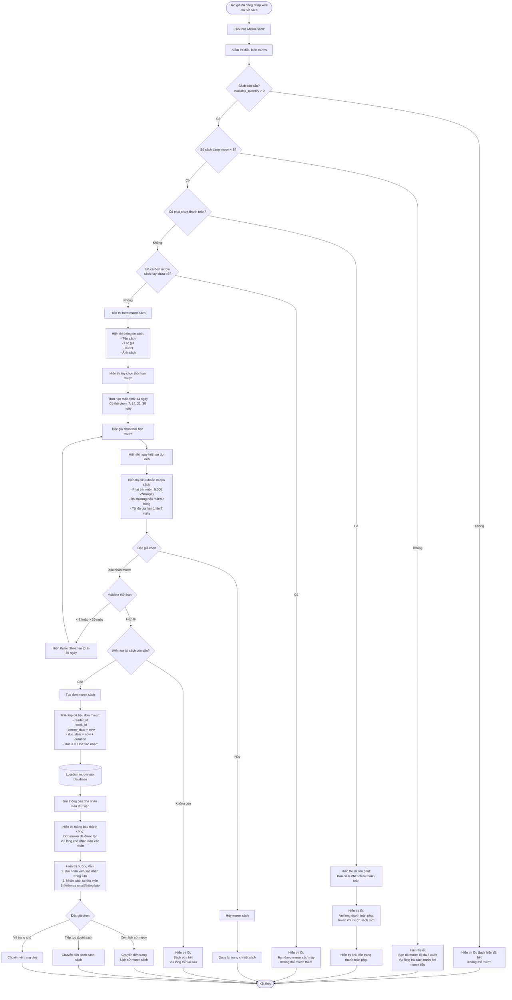

# Feature 2.3.1: Mượn Sách (Độc Giả)

## Mô tả
Cho phép độc giả tạo yêu cầu mượn sách. Yêu cầu sẽ ở trạng thái "Chờ xác nhận" cho đến khi nhân viên thư viện xác nhận.

## Actor
Độc giả (đã đăng nhập)

## Yêu cầu
- Đã đăng nhập (Feature 2.1.2)
- Có vai trò Reader
- Đã xem chi tiết sách (Feature 2.2.4)

## Flowchart



## Business Rules

### Điều Kiện Mượn Sách
1. ✅ **Sách còn sẵn:** `available_quantity > 0`
2. ✅ **Giới hạn mượn:** Độc giả không vượt quá 5 cuốn đang mượn cùng lúc
3. ✅ **Không có phạt:** Không có khoản phạt chưa thanh toán
4. ✅ **Không trùng sách:** Chưa có đơn mượn sách này ở trạng thái "Chờ xác nhận" hoặc "Đang mượn"

### Thời Hạn Mượn
- **Mặc định:** 14 ngày
- **Tối thiểu:** 7 ngày
- **Tối đa:** 30 ngày
- **Gia hạn:** Tối đa 1 lần, mỗi lần +7 ngày

### Phạt
- **Trả muộn:** 5.000 VND/ngày
- **Hư hỏng:** Theo mức phạt do admin cấu hình
- **Mất sách:** Theo mức phạt do admin cấu hình

## Validation Rules

| Field | Rule | Message Error |
|-------|------|---------------|
| Sách | available_quantity > 0 | "Sách hiện đã hết. Không thể mượn" |
| Độc giả | Số sách đang mượn < 5 | "Bạn đã mượn tối đa 5 cuốn. Vui lòng trả sách trước" |
| Độc giả | Không có phạt chưa thanh toán | "Vui lòng thanh toán phạt trước khi mượn sách mới" |
| Độc giả | Chưa mượn sách này | "Bạn đang mượn sách này. Không thể mượn thêm" |
| Thời hạn | 7 <= duration <= 30 | "Thời hạn mượn từ 7 đến 30 ngày" |

## Data Model - Borrow Request
```json
{
  "id": "string (UUID)",
  "reader_id": "string (foreign key)",
  "book_id": "string (foreign key)",
  "borrow_date": "timestamp (now)",
  "due_date": "timestamp (borrow_date + duration days)",
  "return_date": "timestamp (nullable)",
  "duration_days": "number (7-30)",
  "status": "Chờ xác nhận",
  "extended": "boolean (false)",
  "rejection_reason": "string (nullable)",
  "created_at": "timestamp",
  "updated_at": "timestamp"
}
```

## Status Flow
```
Chờ xác nhận → Đã mượn (confirmed by staff)
Chờ xác nhận → Bị từ chối (rejected by staff)
Đã mượn → Quá hạn (auto when due_date passed)
Đã mượn → Đã trả (when returned)
```

## Notifications
- **Tới độc giả:**
  - Đơn mượn đã được tạo
  - Đơn được xác nhận/từ chối
  - Sắp đến hạn trả (2 ngày trước)
  - Quá hạn
  
- **Tới nhân viên:**
  - Có đơn mượn mới chờ xác nhận

## UI Components
- Book info card
- Duration selector (dropdown or buttons)
- Due date calculator (real-time)
- Terms & conditions checkbox
- Confirm/Cancel buttons
- Success modal with next steps

## Notes
- Đơn mượn tạo với trạng thái "Chờ xác nhận"
- Nhân viên có 24h để xác nhận đơn
- Độc giả cần đến thư viện để nhận sách vật lý sau khi được xác nhận
- Có thể thêm tính năng đặt lịch nhận sách (future enhancement)

