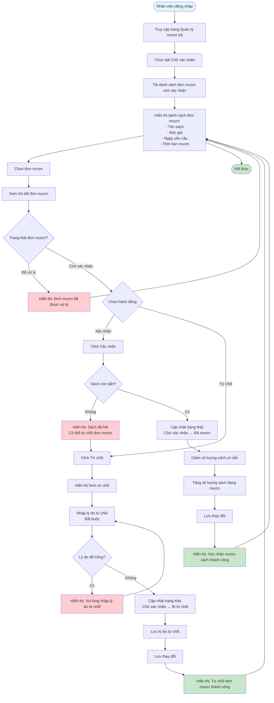

# Feature 2.3.2: Mượn Sách - Nhân Viên (Borrow Book - Librarian)

## Mô tả
Tính năng cho phép nhân viên thư viện xem danh sách đơn mượn chờ xác nhận và xác nhận hoặc từ chối đơn mượn.

## Actor
Nhân viên thư viện

## Phụ thuộc
- 2.1.2 (Cần đăng nhập)
- 2.3.1 (Cần có đơn mượn từ độc giả)

## Flowchart

## Validation Rules
- **Lý do từ chối:** Bắt buộc phải nhập

## Edge Cases
- Đơn mượn đã được xử lý → Không cho phép xác nhận/từ chối lại
- Sách đã hết sau khi tạo đơn → Có thể từ chối hoặc cảnh báo
- Sách đã bị xóa → Từ chối đơn mượn
- Lý do từ chối để trống → Yêu cầu nhập lý do

