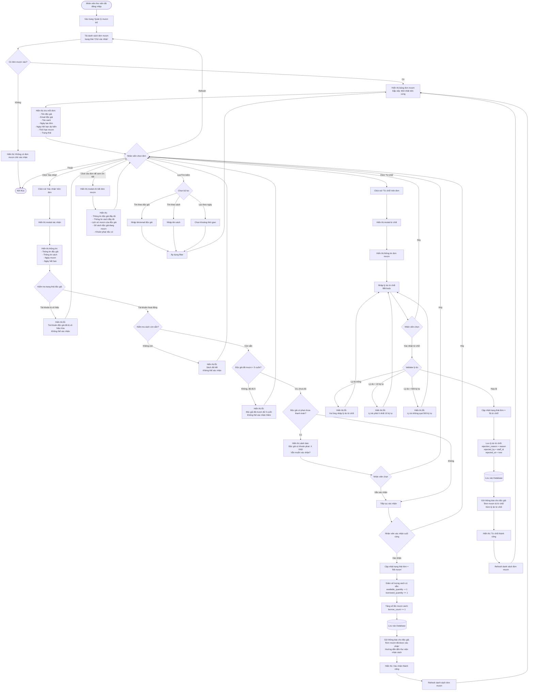

# Feature 2.3.2: Mượn Sách (Nhân Viên Thư Viện)

## Mô tả
Cho phép nhân viên thư viện xem danh sách đơn mượn chờ xác nhận và xác nhận hoặc từ chối đơn mượn.

## Actor
Nhân viên thư viện, Admin

## Yêu cầu
- Đã đăng nhập (Feature 2.1.2)
- Có vai trò Librarian hoặc Admin
- Độc giả đã tạo đơn mượn (Feature 2.3.1)

## Flowchart



## Business Rules

### Điều Kiện Xác Nhận
1. ✅ Tài khoản độc giả không bị vô hiệu hóa
2. ✅ Sách còn sẵn (`available_quantity > 0`)
3. ✅ Độc giả chưa mượn quá 5 cuốn
4. ⚠️ Độc giả có phạt chưa thanh toán → Cảnh báo nhưng vẫn có thể xác nhận

### Điều Kiện Từ Chối
1. ✅ Bắt buộc nhập lý do từ chối
2. ✅ Lý do: 10-500 ký tự

## Validation Rules

### Xác Nhận
| Check | Rule | Action |
|-------|------|--------|
| Tài khoản độc giả | Không bị vô hiệu hóa | Block nếu bị vô hiệu |
| Sách có sẵn | available_quantity > 0 | Block nếu hết sách |
| Giới hạn mượn | Số sách đang mượn < 5 | Block nếu đã đủ 5 |
| Phạt chưa thanh toán | Kiểm tra unpaid fines | Cảnh báo, cho phép xác nhận |

### Từ Chối
| Field | Rule | Message Error |
|-------|------|---------------|
| Lý do | Không được để trống | "Vui lòng nhập lý do từ chối" |
| Lý do | Tối thiểu 10 ký tự | "Lý do phải ít nhất 10 ký tự" |
| Lý do | Tối đa 500 ký tự | "Lý do không được vượt quá 500 ký tự" |

## Data Model - Update on Confirm
```json
{
  "status": "Đã mượn",
  "confirmed_by": "staff_id",
  "confirmed_at": "timestamp",
  "actual_borrow_date": "timestamp",
  "updated_at": "timestamp"
}
```

## Data Model - Update on Reject
```json
{
  "status": "Bị từ chối",
  "rejection_reason": "string (10-500 chars)",
  "rejected_by": "staff_id",
  "rejected_at": "timestamp",
  "updated_at": "timestamp"
}
```

## Display Information

Mỗi đơn mượn hiển thị:

| Field | Description |
|-------|-------------|
| ID | Mã đơn mượn |
| Độc giả | Tên + Email |
| Sách | Tên sách |
| Ngày tạo đơn | Thời gian gửi yêu cầu |
| Ngày hết hạn dự kiến | Due date |
| Thời hạn | Số ngày mượn |
| Trạng thái | Badge: Chờ xác nhận |
| Actions | Nút Xác nhận / Từ chối / Xem chi tiết |

## Notifications

### Khi Xác Nhận
**Tới độc giả:**
- Tiêu đề: "Đơn mượn được xác nhận"
- Nội dung: Chi tiết đơn + hướng dẫn nhận sách
- Email + In-app notification

### Khi Từ Chối
**Tới độc giả:**
- Tiêu đề: "Đơn mượn bị từ chối"
- Nội dung: Lý do từ chối + hướng dẫn liên hệ
- Email + In-app notification

## UI Components
- Table/List view với sorting
- Search & Filter bar
- Badge cho status
- Action buttons (Confirm/Reject/Detail)
- Modal cho confirm/reject/detail
- Pagination (if needed)
- Real-time update (optional: WebSocket)

## Notes
- Đơn mượn sau khi xác nhận sẽ chuyển sang trạng thái "Đang mượn"
- Số lượng sách được cập nhật ngay lập tức
- Độc giả nhận thông báo qua email và trong app
- Có thể in phiếu mượn sách để giao cho độc giả
- Nhân viên nên kiểm tra sách vật lý trước khi xác nhận

