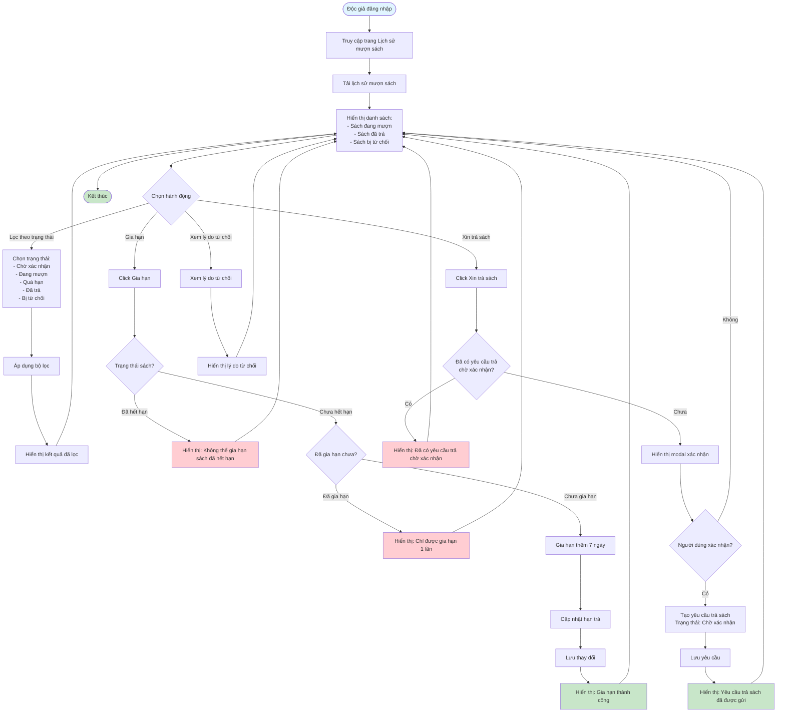

# Feature 2.3.3: Xem Lịch Sử Mượn Sách (View Borrowing History)

## Mô tả
Tính năng cho phép độc giả xem lịch sử mượn sách, gia hạn sách, và tạo yêu cầu trả sách.

## Actor
Độc giả

## Phụ thuộc
- 2.1.2 (Cần đăng nhập)
- 2.3.1 (Cần có đơn mượn)

## Flowchart

## Thông tin hiển thị
- **Sách đang mượn:** Tên, Tác giả, Ngày mượn, Hạn trả, Số ngày còn lại
- **Sách đã trả:** Tên, Ngày mượn, Ngày trả
- **Sách bị từ chối:** Tên, Tác giả, Lý do từ chối

## Chức năng
- Lọc theo trạng thái
- Xem lý do từ chối (nếu có)
- Gia hạn sách (+7 ngày, tối đa 1 lần)
- Tạo yêu cầu trả sách

## Edge Cases
- Sách quá hạn → Hiển thị cảnh báo và số ngày quá hạn
- Đã gia hạn rồi → Không cho phép gia hạn thêm
- Đã có yêu cầu trả chờ xác nhận → Không cho phép tạo yêu cầu mới
- Không có sách nào → Hiển thị thông báo trống

