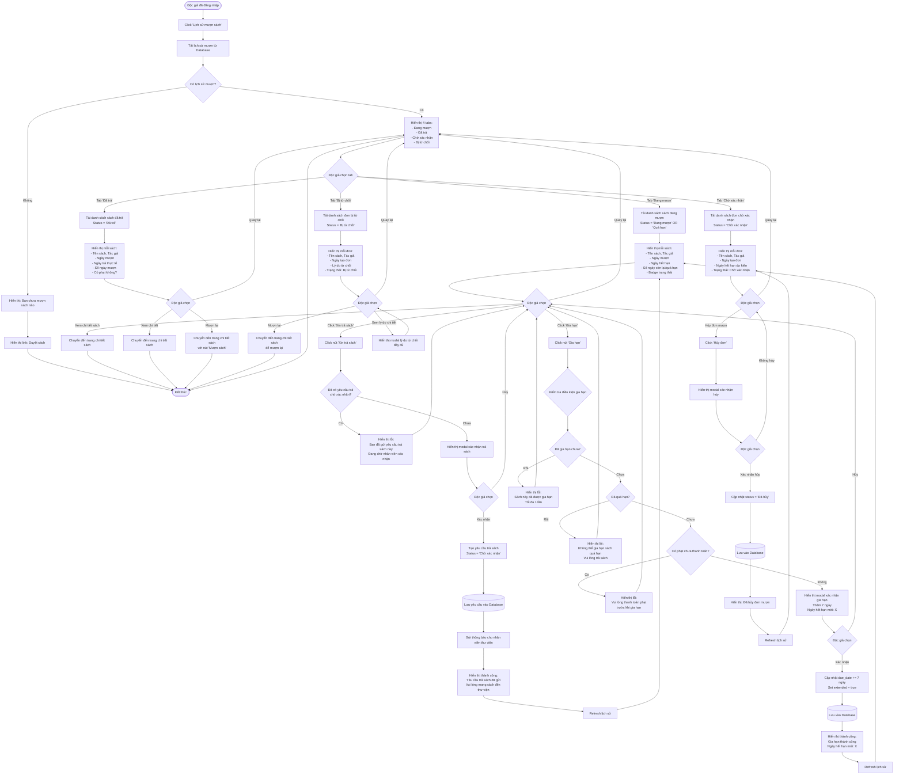

# Feature 2.3.3: Xem Lịch Sử Mượn Sách

## Mô tả
Cho phép độc giả xem lịch sử các đơn mượn sách của mình, bao gồm: đang mượn, đã trả, bị từ chối. Độc giả có thể tạo yêu cầu trả sách và gia hạn sách.

## Actor
Độc giả (đã đăng nhập)

## Yêu cầu
- Đã đăng nhập (Feature 2.1.2)
- Có vai trò Reader
- Đã có đơn mượn (Feature 2.3.1)

## Flowchart



## Display Information

### Tab: Đang Mượn
```json
{
  "book_title": "string",
  "author": "string",
  "book_image": "URL",
  "borrow_date": "date",
  "due_date": "date",
  "days_remaining": "number (positive = còn lại, negative = quá hạn)",
  "status": "Đang mượn | Quá hạn",
  "extended": "boolean",
  "can_extend": "boolean",
  "can_return": "boolean"
}
```

### Tab: Đã Trả
```json
{
  "book_title": "string",
  "author": "string",
  "borrow_date": "date",
  "return_date": "date",
  "days_borrowed": "number",
  "was_late": "boolean",
  "fine_amount": "number (nullable)"
}
```

### Tab: Chờ Xác Nhận
```json
{
  "book_title": "string",
  "author": "string",
  "request_date": "date",
  "expected_due_date": "date",
  "status": "Chờ xác nhận",
  "can_cancel": "boolean"
}
```

### Tab: Bị Từ Chối
```json
{
  "book_title": "string",
  "author": "string",
  "request_date": "date",
  "rejection_reason": "string",
  "rejected_date": "date",
  "status": "Bị từ chối"
}
```

## Business Rules

### Gia Hạn Sách
1. ✅ Chưa quá hạn
2. ✅ Chưa gia hạn lần nào (tối đa 1 lần)
3. ✅ Không có phạt chưa thanh toán
4. ✅ Thêm 7 ngày vào `due_date`

### Tạo Yêu Cầu Trả Sách
1. ✅ Chưa có yêu cầu trả ở trạng thái "Chờ xác nhận"
2. ✅ Đơn mượn ở trạng thái "Đang mượn" hoặc "Quá hạn"

### Hủy Đơn Mượn
1. ✅ Đơn mượn ở trạng thái "Chờ xác nhận"
2. ✅ Chưa được nhân viên xác nhận

## Validation Rules

| Action | Condition | Message Error |
|--------|-----------|---------------|
| Gia hạn | Chưa gia hạn | "Sách này đã được gia hạn. Tối đa 1 lần" |
| Gia hạn | Chưa quá hạn | "Không thể gia hạn sách quá hạn" |
| Gia hạn | Không có phạt | "Vui lòng thanh toán phạt trước khi gia hạn" |
| Trả sách | Chưa có yêu cầu trả | "Bạn đã gửi yêu cầu trả sách này" |
| Hủy đơn | Đơn chờ xác nhận | "Không thể hủy đơn đã được xác nhận" |

## UI Features

### Badges
- 🟢 **Đang mượn** (còn > 3 ngày)
- 🟡 **Sắp hết hạn** (còn 1-3 ngày)
- 🔴 **Quá hạn** (đã quá due_date)
- ⚪ **Đã trả**
- 🔵 **Chờ xác nhận**
- 🔴 **Bị từ chối**

### Actions per Tab
| Tab | Available Actions |
|-----|------------------|
| Đang mượn | Xin trả sách, Gia hạn, Xem chi tiết |
| Đã trả | Xem chi tiết, Mượn lại |
| Chờ xác nhận | Hủy đơn, Xem chi tiết |
| Bị từ chối | Xem lý do, Mượn lại |

## Auto Status Update
- Đơn mượn tự động chuyển sang "Quá hạn" khi `now > due_date`
- Cập nhật real-time hoặc scheduled job

## Notifications
- Sắp hết hạn (2 ngày trước)
- Quá hạn (ngay khi quá hạn)
- Đơn được xác nhận/từ chối
- Yêu cầu trả được xác nhận

## Notes
- Tab mặc định là "Đang mượn"
- Hiển thị số lượng đơn ở mỗi tab (badge count)
- Có thể sort theo ngày (mới nhất/cũ nhất)
- Có thể search theo tên sách
- Responsive design cho mobile

