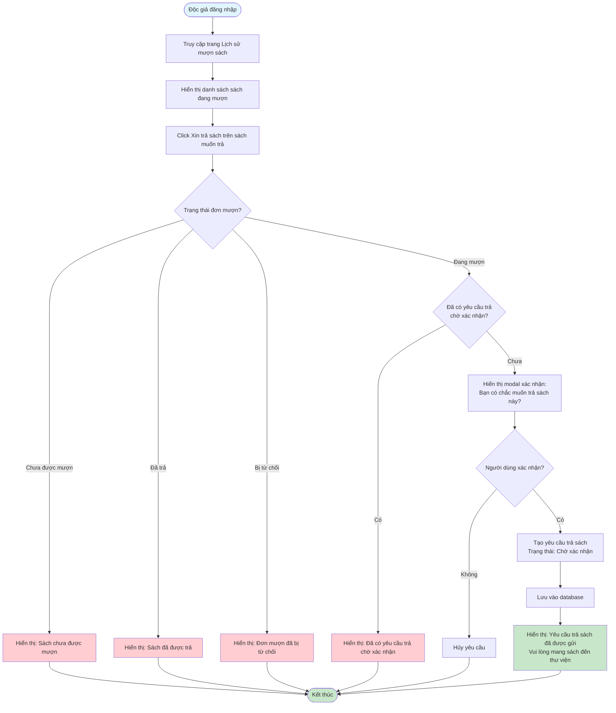

# Feature 2.4.1: Yêu Cầu Trả Sách (Return Request)

## Mô tả
Tính năng cho phép độc giả tạo yêu cầu trả sách để nhân viên xác nhận.

## Actor
Độc giả

## Phụ thuộc
- 2.1.2 (Cần đăng nhập)
- 2.3.1 (Cần có sách đang mượn)

## Flowchart

## Lưu ý
- Độc giả cần mang sách đến thư viện để nhân viên xác nhận
- Một đơn mượn chỉ có thể tạo một yêu cầu trả ở trạng thái "Chờ xác nhận"

## Edge Cases
- Đơn mượn đã ở trạng thái "Đã trả" → Không cho phép tạo yêu cầu mới
- Đơn mượn bị từ chối → Không cho phép tạo yêu cầu trả
- Đã có yêu cầu trả chờ xác nhận → Không cho phép tạo yêu cầu mới

