# Feature 2.4.1: Yêu Cầu Trả Sách

## Mô tả
Cho phép độc giả tạo yêu cầu trả sách khi muốn trả sách đang mượn. Yêu cầu sẽ chờ nhân viên xác nhận.

## Actor
Độc giả (đã đăng nhập)

## Yêu cầu
- Đã đăng nhập (Feature 2.1.2)
- Có vai trò Reader
- Có sách đang mượn (Feature 2.3.1)

## Flowchart

```mermaid
flowchart TD
    Start([Độc giả vào trang Lịch sử mượn sách]) --> ViewBorrowing[Xem tab 'Đang mượn']
    ViewBorrowing --> DisplayBorrowedBooks[Hiển thị danh sách sách đang mượn]
    
    DisplayBorrowedBooks --> SelectBook[Độc giả chọn sách muốn trả]
    SelectBook --> ClickReturn[Click nút 'Xin trả sách']
    
    ClickReturn --> CheckExistingRequest{Kiểm tra yêu cầu trả hiện có}
    CheckExistingRequest --> HasPendingReturn{Đã có yêu cầu trả<br/>ở trạng thái<br/>'Chờ xác nhận'?}
    
    HasPendingReturn -->|Có| ErrorAlreadyRequested[Hiển thị lỗi:<br/>Bạn đã gửi yêu cầu trả sách này<br/>Đang chờ nhân viên xác nhận<br/>Không thể gửi yêu cầu mới]
    ErrorAlreadyRequested --> ShowPendingRequestInfo[Hiển thị thông tin yêu cầu đang chờ:<br/>- Ngày gửi yêu cầu<br/>- Trạng thái<br/>- Hướng dẫn mang sách đến thư viện]
    ShowPendingRequestInfo --> End([Kết thúc])
    
    HasPendingReturn -->|Chưa| CheckBorrowStatus{Kiểm tra trạng thái đơn mượn}
    CheckBorrowStatus --> ValidStatus{Trạng thái =<br/>'Đang mượn' OR 'Quá hạn'?}
    
    ValidStatus -->|Không| ErrorInvalidStatus[Hiển thị lỗi:<br/>Không thể tạo yêu cầu trả<br/>cho đơn mượn này]
    ErrorInvalidStatus --> End
    
    ValidStatus -->|Có| ShowReturnModal[Hiển thị modal xác nhận trả sách]
    ShowReturnModal --> DisplayBookInfo[Hiển thị thông tin sách:<br/>- Ảnh sách<br/>- Tên sách<br/>- Tác giả<br/>- Ngày mượn<br/>- Ngày hết hạn<br/>- Trạng thái hiện tại]
    
    DisplayBookInfo --> CheckOverdue{Sách đã quá hạn?}
    CheckOverdue -->|Có| CalculateLateFine[Tính phí phạt trả muộn:<br/>Số ngày quá hạn × 5.000 VND]
    CalculateLateFine --> ShowLateWarning[Hiển thị cảnh báo:<br/>Sách quá hạn X ngày<br/>Phí phạt dự kiến: Y VND<br/>Nếu sách bình thường]
    ShowLateWarning --> ShowInstructions
    
    CheckOverdue -->|Không| ShowInstructions[Hiển thị hướng dẫn:<br/>1. Mang sách đến thư viện<br/>2. Nhân viên sẽ kiểm tra tình trạng sách<br/>3. Xác nhận trả sách<br/>4. Nếu có phạt, thanh toán trước khi hoàn tất]
    
    ShowInstructions --> ShowTerms[Hiển thị điều khoản:<br/>- Sách bình thường: Không phạt thêm<br/>- Sách hư hỏng: Phạt theo mức cấu hình<br/>- Sách mất: Phạt theo mức cấu hình<br/>+ Phạt trả muộn nếu quá hạn]
    
    ShowTerms --> ReturnAction{Độc giả chọn}
    ReturnAction -->|Hủy| CancelReturn[Hủy yêu cầu trả sách]
    CancelReturn --> RedirectBack[Quay lại trang lịch sử]
    RedirectBack --> End
    
    ReturnAction -->|Xác nhận| ValidateBorrowId{Validate borrow_id}
    ValidateBorrowId -->|Không hợp lệ| ErrorInvalidBorrow[Hiển thị lỗi: Đơn mượn không tồn tại]
    ErrorInvalidBorrow --> End
    ValidateBorrowId -->|Hợp lệ| CreateReturnRequest[Tạo yêu cầu trả sách]
    
    CreateReturnRequest --> SetReturnData[Thiết lập dữ liệu:<br/>- borrow_id<br/>- reader_id<br/>- book_id<br/>- request_date = now<br/>- status = 'Chờ xác nhận'<br/>- is_overdue = check overdue<br/>- overdue_days = calculate if overdue]
    
    SetReturnData --> SaveRequest[(Lưu yêu cầu trả vào Database)]
    SaveRequest --> SendNotification[Gửi thông báo cho nhân viên thư viện:<br/>Có yêu cầu trả sách mới]
    SendNotification --> UpdateBorrowStatus[Cập nhật đơn mượn:<br/>Thêm flag 'has_return_request' = true]
    
    UpdateBorrowStatus --> SaveUpdate[(Lưu cập nhật vào Database)]
    SaveUpdate --> ShowSuccess[Hiển thị thông báo thành công:<br/>Yêu cầu trả sách đã được gửi]
    
    ShowSuccess --> ShowNextSteps[Hiển thị hướng dẫn tiếp theo:<br/>1. Mang sách đến thư viện<br/>2. Gặp nhân viên để xác nhận trả<br/>3. Nhân viên sẽ kiểm tra sách<br/>4. Nhận xác nhận đã trả]
    
    ShowNextSteps --> ShowRequestInfo[Hiển thị thông tin yêu cầu:<br/>- Mã yêu cầu<br/>- Ngày gửi<br/>- Trạng thái: Chờ xác nhận<br/>- Địa chỉ thư viện<br/>- Giờ làm việc]
    
    ShowRequestInfo --> UserChoice{Độc giả chọn}
    UserChoice -->|Xem yêu cầu của tôi| RedirectMyRequests[Chuyển đến trang<br/>Yêu cầu trả sách của tôi]
    UserChoice -->|Tiếp tục duyệt| RedirectBookList[Chuyển đến danh sách sách]
    UserChoice -->|Về trang chủ| RedirectHome[Về trang chủ]
    
    RedirectMyRequests --> End
    RedirectBookList --> End
    RedirectHome --> End
```



## Business Rules

### Điều Kiện Tạo Yêu Cầu Trả
1. ✅ Đơn mượn ở trạng thái "Đang mượn" hoặc "Quá hạn"
2. ✅ Chưa có yêu cầu trả ở trạng thái "Chờ xác nhận"
3. ✅ Một đơn mượn chỉ có 1 yêu cầu trả "Chờ xác nhận" tại một thời điểm

### Phạt Trả Muộn
- **Công thức:** `số_ngày_quá_hạn × 5.000 VND`
- **Tính từ:** Ngày sau `due_date`
- **Áp dụng:** Tự động khi nhân viên xác nhận trả

### Quy Trình Trả Sách
1. Độc giả tạo yêu cầu trả online
2. Mang sách đến thư viện
3. Nhân viên kiểm tra tình trạng sách
4. Nhân viên xác nhận và cập nhật trạng thái
5. Nếu có phạt → Độc giả thanh toán
6. Hoàn tất trả sách

## Validation Rules

| Check | Rule | Message Error |
|-------|------|---------------|
| Đơn mượn | Phải tồn tại | "Đơn mượn không tồn tại" |
| Trạng thái | "Đang mượn" hoặc "Quá hạn" | "Không thể tạo yêu cầu trả cho đơn này" |
| Yêu cầu hiện có | Chưa có yêu cầu chờ xác nhận | "Bạn đã gửi yêu cầu trả sách này" |
| Reader | Phải là người mượn sách | "Bạn không có quyền trả sách này" |

## Data Model - Return Request
```json
{
  "id": "string (UUID)",
  "borrow_id": "string (foreign key)",
  "reader_id": "string (foreign key)",
  "book_id": "string (foreign key)",
  "request_date": "timestamp (now)",
  "status": "Chờ xác nhận",
  "is_overdue": "boolean",
  "overdue_days": "number (0 if not overdue)",
  "estimated_late_fine": "number (nullable)",
  "created_at": "timestamp",
  "updated_at": "timestamp"
}
```

## Status Flow - Return Request
```
Chờ xác nhận → Đã xác nhận (by staff at Feature 2.4.2)
```

## Notifications

### Tới Nhân Viên
- **Tiêu đề:** "Yêu cầu trả sách mới"
- **Nội dung:**
  - Tên độc giả
  - Tên sách
  - Ngày yêu cầu
  - Trạng thái quá hạn (nếu có)
- **Channel:** Email + In-app notification

### Tới Độc Giả (Confirmation)
- **Tiêu đề:** "Yêu cầu trả sách đã được gửi"
- **Nội dung:**
  - Mã yêu cầu
  - Thông tin sách
  - Hướng dẫn mang sách đến thư viện
  - Địa chỉ và giờ làm việc thư viện
- **Channel:** Email + In-app notification

## Display Information

### Thông Tin Hiển Thị Trong Modal
```json
{
  "book": {
    "title": "string",
    "author": "string",
    "image": "URL"
  },
  "borrow_info": {
    "borrow_date": "date",
    "due_date": "date",
    "status": "Đang mượn | Quá hạn"
  },
  "return_info": {
    "is_overdue": "boolean",
    "overdue_days": "number",
    "estimated_late_fine": "number VND"
  },
  "instructions": [
    "Mang sách đến thư viện",
    "Gặp nhân viên để xác nhận",
    "Nhân viên kiểm tra tình trạng sách",
    "Thanh toán phạt (nếu có)"
  ]
}
```

## UI Components
- Modal xác nhận trả sách
- Book info card
- Warning badge (nếu quá hạn)
- Estimated fine display (nếu quá hạn)
- Instructions list
- Terms & conditions
- Confirm/Cancel buttons
- Success modal với next steps

## Notes
- Yêu cầu trả sách không giảm số lượng sách đang mượn ngay lập tức
- Chỉ khi nhân viên xác nhận (Feature 2.4.2) thì số lượng mới được cập nhật
- Độc giả cần mang sách vật lý đến thư viện
- Một đơn mượn chỉ có thể có 1 yêu cầu trả "Chờ xác nhận"
- Nếu nhân viên từ chối hoặc độc giả hủy, có thể tạo yêu cầu mới
- Hiển thị ước tính phạt (nếu quá hạn) để độc giả biết trước

