# Feature 2.4.2: Xác Nhận Trả Sách

## Mô tả
Cho phép nhân viên thư viện xác nhận trả sách, kiểm tra tình trạng sách và tạo phiếu phạt (nếu cần).

## Actor
Nhân viên thư viện, Admin

## Yêu cầu
- Đã đăng nhập (Feature 2.1.2)
- Có vai trò Librarian hoặc Admin
- Độc giả đã tạo yêu cầu trả sách (Feature 2.4.1)

## Flowchart

```mermaid
flowchart TD
    Start([Nhân viên thư viện đã đăng nhập]) --> AccessReturnManagement[Vào trang 'Quản lý mượn trả'<br/>Tab 'Chờ xác nhận trả']
    
    AccessReturnManagement --> LoadReturnRequests[Tải danh sách yêu cầu trả sách<br/>Status = 'Chờ xác nhận']
    
    LoadReturnRequests --> CheckHasRequests{Có yêu cầu nào?}
    CheckHasRequests -->|Không| ShowNoRequests[Hiển thị: Không có yêu cầu trả sách]
    ShowNoRequests --> End([Kết thúc])
    
    CheckHasRequests -->|Có| DisplayRequests[Hiển thị bảng yêu cầu trả sách]
    DisplayRequests --> ShowRequestInfo[Hiển thị cho mỗi yêu cầu:<br/>- Tên độc giả<br/>- Tên sách<br/>- Ngày mượn<br/>- Ngày hết hạn<br/>- Ngày yêu cầu trả<br/>- Trạng thái quá hạn<br/>- Số ngày quá hạn]
    
    ShowRequestInfo --> StaffSelectRequest[Nhân viên chọn yêu cầu]
    StaffSelectRequest --> ClickConfirm[Click 'Xác nhận trả']
    
    ClickConfirm --> ReceivePhysicalBook[Nhân viên nhận sách vật lý từ độc giả]
    ReceivePhysicalBook --> ShowConfirmModal[Hiển thị modal xác nhận trả sách]
    
    ShowConfirmModal --> DisplayFullInfo[Hiển thị đầy đủ thông tin:<br/>- Thông tin độc giả<br/>- Thông tin sách<br/>- Ngày mượn<br/>- Ngày hết hạn<br/>- Ngày trả thực tế<br/>- Số ngày quá hạn nếu có]
    
    DisplayFullInfo --> InspectBook[Nhân viên kiểm tra tình trạng sách vật lý]
    InspectBook --> SelectCondition[Chọn tình trạng sách]
    
    SelectCondition --> ConditionChoice{Nhân viên chọn tình trạng}
    
    %% ============ LUỒNG: SÁCH BÌNH THƯỜNG ============
    ConditionChoice -->|Bình thường| ConditionNormal[Chọn 'Bình thường']
    ConditionNormal --> CheckOverdueNormal{Sách có quá hạn?}
    
    CheckOverdueNormal -->|Không| ConfirmNormalOnTime[Xác nhận không có phạt]
    ConfirmNormalOnTime --> UpdateBorrowNormal[Cập nhật đơn mượn:<br/>- status = 'Đã trả'<br/>- return_date = now<br/>- condition = 'Bình thường']
    UpdateBorrowNormal --> UpdateBookNormal[Cập nhật số lượng sách:<br/>- available_quantity += 1<br/>- borrowed_quantity -= 1]
    UpdateBookNormal --> SaveNormal[(Lưu vào Database)]
    SaveNormal --> ShowSuccessNormal[Hiển thị: Xác nhận trả sách thành công<br/>Không có phạt]
    ShowSuccessNormal --> NotifyReaderNormal[Gửi thông báo cho độc giả:<br/>Đã trả sách thành công]
    NotifyReaderNormal --> RefreshList1[Refresh danh sách]
    RefreshList1 --> DisplayRequests
    
    CheckOverdueNormal -->|Có| CalculateLateFine[Tính phạt trả muộn:<br/>overdue_days × 5.000 VND]
    CalculateLateFine --> ShowLateFine[Hiển thị số tiền phạt trả muộn]
    ShowLateFine --> ConfirmNormalLate[Xác nhận tạo phiếu phạt trả muộn]
    
    ConfirmNormalLate --> CreateLateFine[Tạo phiếu phạt trả muộn]
    CreateLateFine --> SetLateFineData[Thiết lập dữ liệu phiếu phạt:<br/>- reader_id<br/>- borrow_id<br/>- fine_type = 'Trả muộn'<br/>- amount = calculated<br/>- status = 'Chưa thanh toán']
    SetLateFineData --> UpdateBorrowLate[Cập nhật đơn mượn = 'Đã trả']
    UpdateBorrowLate --> UpdateBookLate[Cập nhật số lượng sách]
    UpdateBookLate --> SaveLate[(Lưu vào Database)]
    SaveLate --> ShowSuccessLate[Hiển thị: Xác nhận thành công<br/>Đã tạo phiếu phạt trả muộn]
    ShowSuccessLate --> NotifyReaderLate[Gửi thông báo:<br/>Đã trả sách + có phạt trả muộn]
    NotifyReaderLate --> RefreshList2[Refresh danh sách]
    RefreshList2 --> DisplayRequests
    
    %% ============ LUỒNG: SÁCH HƯ HỎNG ============
    ConditionChoice -->|Hư hỏng| ConditionDamaged[Chọn 'Hư hỏng']
    ConditionDamaged --> LoadFineLevels1[Tải danh sách mức phạt hư hỏng<br/>từ cấu hình admin]
    LoadFineLevels1 --> SelectDamageFineLevel[Chọn mức phạt hư hỏng]
    
    SelectDamageFineLevel --> ValidateDamageLevel{Đã chọn mức phạt?}
    ValidateDamageLevel -->|Chưa| ErrorNoDamageLevel[Hiển thị lỗi: Vui lòng chọn mức phạt]
    ErrorNoDamageLevel --> SelectDamageFineLevel
    ValidateDamageLevel -->|Rồi| InputDamageNote[Nhập ghi chú về hư hỏng<br/>Bắt buộc]
    
    InputDamageNote --> ValidateDamageNote{Validate ghi chú}
    ValidateDamageNote -->|Trống| ErrorEmptyNote1[Hiển thị lỗi: Ghi chú không được trống]
    ErrorEmptyNote1 --> InputDamageNote
    ValidateDamageNote -->|> 500 ký tự| ErrorLongNote1[Hiển thị lỗi: Ghi chú không quá 500 ký tự]
    ErrorLongNote1 --> InputDamageNote
    ValidateDamageNote -->|Hợp lệ| CheckOverdueDamaged{Sách có quá hạn?}
    
    CheckOverdueDamaged -->|Không| CreateDamageFineOnly[Tạo phiếu phạt hư hỏng]
    CheckOverdueDamaged -->|Có| CreateBothFines[Tạo 2 phiếu phạt:<br/>1. Hư hỏng<br/>2. Trả muộn]
    
    CreateDamageFineOnly --> SetDamageFineData1[Set dữ liệu phiếu phạt hư hỏng]
    CreateBothFines --> SetDamageFineData2[Set dữ liệu 2 phiếu phạt]
    
    SetDamageFineData1 --> UpdateBorrowDamaged[Cập nhật đơn mượn:<br/>- status = 'Đã trả'<br/>- condition = 'Hư hỏng'<br/>- damage_note]
    SetDamageFineData2 --> UpdateBorrowDamaged
    
    UpdateBorrowDamaged --> UpdateBookDamaged[Cập nhật sách:<br/>- available_quantity += 1<br/>- borrowed_quantity -= 1<br/>- damaged_quantity += 1 nếu có field]
    UpdateBookDamaged --> SaveDamaged[(Lưu vào Database)]
    SaveDamaged --> ShowSuccessDamaged[Hiển thị: Xác nhận thành công<br/>Đã tạo phiếu phạt]
    ShowSuccessDamaged --> NotifyReaderDamaged[Gửi thông báo:<br/>Đã trả sách + phiếu phạt hư hỏng]
    NotifyReaderDamaged --> RefreshList3[Refresh danh sách]
    RefreshList3 --> DisplayRequests
    
    %% ============ LUỒNG: SÁCH MẤT ============
    ConditionChoice -->|Mất| ConditionLost[Chọn 'Mất']
    ConditionLost --> LoadFineLevels2[Tải danh sách mức phạt mất sách<br/>từ cấu hình admin]
    LoadFineLevels2 --> SelectLostFineLevel[Chọn mức phạt mất sách]
    
    SelectLostFineLevel --> ValidateLostLevel{Đã chọn mức phạt?}
    ValidateLostLevel -->|Chưa| ErrorNoLostLevel[Hiển thị lỗi: Vui lòng chọn mức phạt]
    ErrorNoLostLevel --> SelectLostFineLevel
    ValidateLostLevel -->|Rồi| InputLostNote[Nhập ghi chú<br/>Bắt buộc]
    
    InputLostNote --> ValidateLostNote{Validate ghi chú}
    ValidateLostNote -->|Trống| ErrorEmptyNote2[Hiển thị lỗi: Ghi chú không được trống]
    ErrorEmptyNote2 --> InputLostNote
    ValidateLostNote -->|> 500 ký tự| ErrorLongNote2[Hiển thị lỗi: Ghi chú không quá 500 ký tự]
    ErrorLongNote2 --> InputLostNote
    ValidateLostNote -->|Hợp lệ| CheckOverdueLost{Sách có quá hạn?}
    
    CheckOverdueLost -->|Không| CreateLostFineOnly[Tạo phiếu phạt mất sách]
    CheckOverdueLost -->|Có| CreateBothFinesLost[Tạo 2 phiếu phạt:<br/>1. Mất sách<br/>2. Trả muộn]
    
    CreateLostFineOnly --> SetLostFineData1[Set dữ liệu phiếu phạt mất]
    CreateBothFinesLost --> SetLostFineData2[Set dữ liệu 2 phiếu phạt]
    
    SetLostFineData1 --> UpdateBorrowLost[Cập nhật đơn mượn:<br/>- status = 'Đã trả'<br/>- condition = 'Mất'<br/>- lost_note]
    SetLostFineData2 --> UpdateBorrowLost
    
    UpdateBorrowLost --> UpdateBookLost[Cập nhật sách:<br/>- total_quantity -= 1<br/>- borrowed_quantity -= 1<br/>- lost_quantity += 1 nếu có field]
    UpdateBookLost --> SaveLost[(Lưu vào Database)]
    SaveLost --> ShowSuccessLost[Hiển thị: Xác nhận thành công<br/>Đã tạo phiếu phạt mất sách]
    ShowSuccessLost --> NotifyReaderLost[Gửi thông báo:<br/>Đã trả sách + phiếu phạt mất]
    NotifyReaderLost --> RefreshList4[Refresh danh sách]
    RefreshList4 --> DisplayRequests
    
    %% Hủy
    ConditionChoice -->|Hủy| CancelConfirm[Hủy xác nhận]
    CancelConfirm --> DisplayRequests
```



## Business Rules

### Tình Trạng Sách và Xử Lý

| Tình Trạng | Phạt Cần Tạo | Cập Nhật Số Lượng |
|------------|--------------|-------------------|
| **Bình thường** | Chỉ phạt trễ (nếu quá hạn) | available +1, borrowed -1 |
| **Hư hỏng** | Phạt hư hỏng + phạt trễ (nếu có) | available +1, borrowed -1, damaged +1 |
| **Mất** | Phạt mất + phạt trễ (nếu có) | total -1, borrowed -1, lost +1 |

### Phạt Trả Muộn
- **Công thức:** `số_ngày_quá_hạn × 5.000 VND`
- **Áp dụng:** Tự động nếu `return_date > due_date`

### Phạt Hư Hỏng / Mất
- **Mức phạt:** Do admin cấu hình (Feature 2.5.1)
- **Bắt buộc:** Chọn mức phạt và nhập ghi chú

## Validation Rules

| Field | Rule | Message Error |
|-------|------|---------------|
| Tình trạng sách | Bắt buộc chọn | "Vui lòng chọn tình trạng sách" |
| Mức phạt (Hư hỏng/Mất) | Bắt buộc chọn | "Vui lòng chọn mức phạt" |
| Ghi chú (Hư hỏng/Mất) | Bắt buộc, không trống | "Ghi chú không được để trống" |
| Ghi chú | Tối đa 500 ký tự | "Ghi chú không được vượt quá 500 ký tự" |

## Data Model - Update Borrow Record
```json
{
  "status": "Đã trả",
  "return_date": "timestamp (now)",
  "condition": "Bình thường | Hư hỏng | Mất",
  "damage_note": "string (nullable, required if damaged/lost)",
  "overdue_days": "number",
  "confirmed_by": "staff_id",
  "confirmed_at": "timestamp",
  "updated_at": "timestamp"
}
```

## Data Model - Fine Record
```json
{
  "id": "string (UUID)",
  "reader_id": "string",
  "borrow_id": "string",
  "fine_type": "Trả muộn | Hư hỏng | Mất",
  "fine_level_id": "string (nullable, for damage/lost)",
  "amount": "number (VND)",
  "reason": "string",
  "note": "string (nullable)",
  "status": "Chưa thanh toán",
  "created_by": "staff_id",
  "created_at": "timestamp"
}
```

## Display Information

Mỗi yêu cầu trả hiển thị:

| Field | Description |
|-------|-------------|
| Độc giả | Tên + Email |
| Sách | Tên sách + Tác giả |
| Ngày mượn | Borrow date |
| Ngày hết hạn | Due date |
| Ngày yêu cầu trả | Request date |
| Trạng thái | Badge: Đúng hạn / Quá hạn |
| Số ngày quá hạn | Nếu quá hạn |
| Actions | Nút Xác nhận trả |

## Notifications

### Khi Xác Nhận Trả (Bình thường, không phạt)
**Tới độc giả:**
- Tiêu đề: "Đã xác nhận trả sách"
- Nội dung: "Bạn đã trả sách [Tên sách] thành công. Cảm ơn bạn đã sử dụng dịch vụ thư viện."

### Khi Xác Nhận Trả (Có phạt)
**Tới độc giả:**
- Tiêu đề: "Đã xác nhận trả sách - Có phạt"
- Nội dung:
  - Sách đã trả thành công
  - Danh sách phạt cần thanh toán
  - Link thanh toán

## UI Components
- Table/List view yêu cầu trả
- Modal xác nhận với form
- Radio buttons cho tình trạng sách
- Dropdown chọn mức phạt (conditional)
- Textarea cho ghi chú (conditional)
- Fine calculation display
- Confirm/Cancel buttons

## Notes
- Nhân viên phải nhận sách vật lý trước khi xác nhận
- Kiểm tra kỹ tình trạng sách trước khi chọn
- Nếu quá hạn, phạt trễ được tính tự động
- Có thể có nhiều phiếu phạt cho 1 đơn trả (trễ + hư hỏng/mất)
- Tất cả phiếu phạt tạo ra có trạng thái "Chưa thanh toán"
- Độc giả cần thanh toán trước khi có thể mượn sách tiếp

