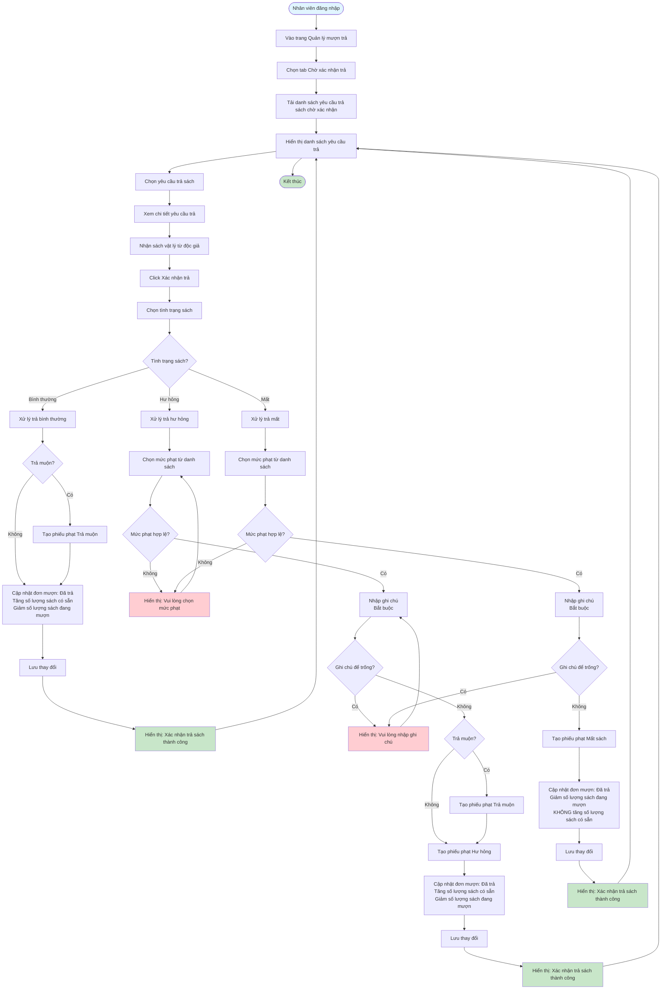

# Feature 2.4.2: Xác Nhận Trả Sách (Confirm Return)

## Mô tả
Tính năng cho phép nhân viên thư viện xác nhận trả sách và xử lý các trường hợp sách bình thường, hư hỏng, hoặc mất.

## Actor
Nhân viên thư viện

## Phụ thuộc
- 2.1.2 (Cần đăng nhập)
- 2.4.1 (Cần có yêu cầu trả sách)

## Flowchart

## Validation Rules
- **Tình trạng sách:** Bắt buộc chọn (bình thường, hư hỏng, mất)
- **Mức phạt:** Bắt buộc khi tình trạng là "hư hỏng", trả muộn hoặc "mất"
- **Ghi chú:** Bắt buộc khi tình trạng là "hư hỏng" hoặc "mất", tối đa 500 ký tự

## Edge Cases
- Sách trả muộn + hư hỏng → Tạo 2 phiếu phạt (muộn + hư hỏng)
- Sách trả muộn + mất → Tạo 2 phiếu phạt (muộn + mất)
- Sách trả sớm → Không tạo phiếu phạt muộn
- Mức phạt không tồn tại → Thông báo lỗi
- Không có mức phạt nào → Yêu cầu tạo mức phạt trước

