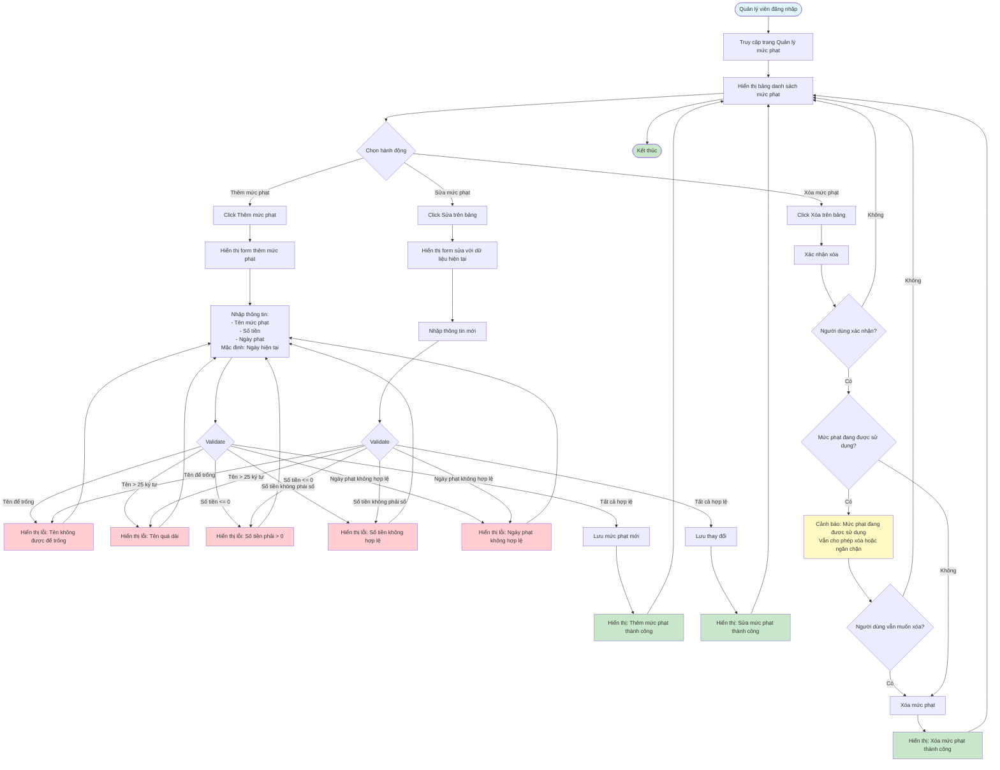

# Feature 2.5.1: Quản lý mức phạt (Fine Level Management)

## Mô tả
Tính năng cho phép quản lý viên quản lý các mức phạt: xem, thêm, sửa, xóa.

## Actor
Quản lý viên

## Phụ thuộc
- 2.1.2 (Cần đăng nhập với vai trò quản lý viên)

## Flowchart

## Validation Rules
- **Tên mức phạt:** Không được để trống, tối đa 25 ký tự
- **Số tiền:** Phải > 0, kiểu số
- **Ngày phạt:** Ngày hợp lệ (mặc định là ngày hiện tại)

## Edge Cases
- Tên mức phạt để trống
- Tên mức phạt quá dài (>25 ký tự)
- Số tiền <= 0 hoặc không phải số
- Ngày phạt không hợp lệ
- Mức phạt đang được sử dụng → Có thể ngăn chặn xóa hoặc cảnh báo

