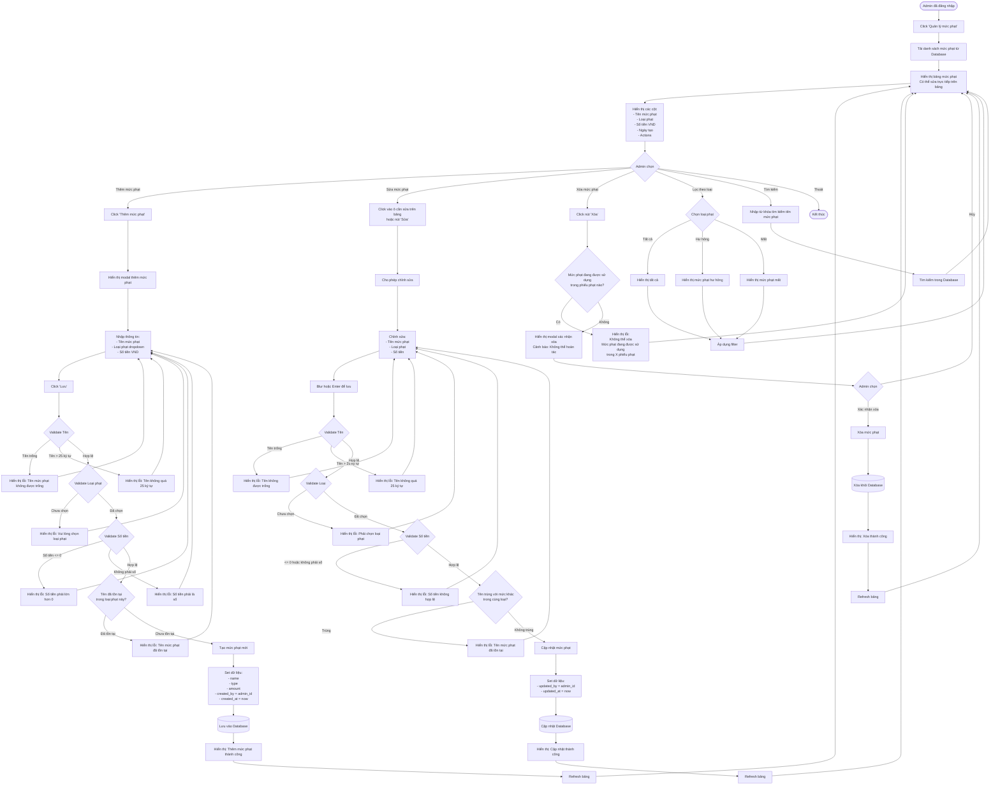

# Feature 2.5.1: Quản Lý Mức Phạt

## Mô tả
Cho phép quản lý viên cấu hình các mức phạt cho hư hỏng sách và mất sách. Nhân viên thư viện sẽ chọn từ các mức phạt này khi xác nhận trả sách.

## Actor
Quản lý viên (Admin)

## Yêu cầu
- Đã đăng nhập (Feature 2.1.2)
- Có vai trò Admin

## Flowchart



## Business Rules

### Loại Phạt
- **Hư hỏng:** Cho sách bị hỏng (rách, mất trang, bẩn,...)
- **Mất:** Cho sách bị mất hoàn toàn

### Mức Phạt Mặc Định (Gợi ý)
| Tên | Loại | Số Tiền |
|-----|------|---------|
| Hư hỏng nhẹ | Hư hỏng | 50,000 VND |
| Hư hỏng vừa | Hư hỏng | 100,000 VND |
| Hư hỏng nặng | Hư hỏng | 200,000 VND |
| Mất sách - Bồi thường 50% | Mất | 150,000 VND |
| Mất sách - Bồi thường 100% | Mất | 300,000 VND |

### Quy Tắc Xóa
- ❌ Không thể xóa nếu mức phạt đang được sử dụng trong bất kỳ phiếu phạt nào
- ✅ Có thể xóa nếu chưa được sử dụng

## Validation Rules

| Field | Rule | Message Error |
|-------|------|---------------|
| Tên mức phạt | Không được để trống | "Tên mức phạt không được để trống" |
| Tên mức phạt | Tối đa 25 ký tự | "Tên mức phạt không được vượt quá 25 ký tự" |
| Tên mức phạt | Unique trong cùng loại phạt | "Tên mức phạt đã tồn tại trong loại này" |
| Loại phạt | Bắt buộc chọn | "Vui lòng chọn loại phạt" |
| Loại phạt | Phải là 'Hư hỏng' hoặc 'Mất' | "Loại phạt không hợp lệ" |
| Số tiền | Phải > 0 | "Số tiền phải lớn hơn 0" |
| Số tiền | Kiểu số | "Số tiền phải là số" |
| Số tiền | Số nguyên dương | "Số tiền phải là số nguyên dương" |

## Data Model
```json
{
  "id": "string (UUID)",
  "name": "string (max 25, unique per type)",
  "type": "Hư hỏng | Mất",
  "amount": "number (> 0, VND)",
  "description": "string (nullable)",
  "created_by": "admin_id",
  "updated_by": "admin_id (nullable)",
  "created_at": "timestamp",
  "updated_at": "timestamp",
  "usage_count": "number (computed, số lần được sử dụng)"
}
```

## Display Information

Mỗi mức phạt hiển thị:

| Column | Description |
|--------|-------------|
| Tên mức phạt | Tên (max 25 chars) |
| Loại phạt | Badge: Hư hỏng / Mất |
| Số tiền | Format: XXX,XXX VND |
| Số lần dùng | Số phiếu phạt sử dụng mức này |
| Ngày tạo | Created date |
| Actions | Edit / Delete buttons |

## UI Components
- Table với inline editing
- Add button (floating hoặc top-right)
- Modal form cho add/edit
- Type filter dropdown
- Search input
- Delete confirmation modal
- Badge cho loại phạt
- Format số tiền (thousand separator)
- Usage count indicator

## Notes
- Admin nên tạo đủ các mức phạt trước khi nhân viên xác nhận trả sách
- Nếu chưa có mức phạt, nhân viên không thể xử lý sách hư hỏng/mất
- Có thể thêm description field để ghi chú chi tiết về mức phạt
- Số tiền nên là số nguyên, không có phần thập phân
- Có thể thêm tính năng sắp xếp theo tên/số tiền/ngày tạo
- Usage count giúp admin biết mức phạt nào được dùng nhiều

