# Feature 2.5.2: Xem & Thanh Toán Phạt (Độc Giả)

## Mô tả
Cho phép độc giả xem danh sách các khoản phạt của mình và đánh dấu đã thanh toán sau khi chuyển khoản.

## Actor
Độc giả (đã đăng nhập)

## Yêu cầu
- Đã đăng nhập (Feature 2.1.2)
- Có vai trò Reader
- Có phiếu phạt (từ Feature 2.4.2)
- Đã có mức phạt cấu hình (Feature 2.5.1)

## Flowchart

```mermaid
flowchart TD
    Start([Độc giả đã đăng nhập]) --> ClickFines[Click 'Khoản phạt của tôi']
    ClickFines --> LoadFines[Tải danh sách phiếu phạt từ Database]
    
    LoadFines --> CheckHasFines{Có phiếu phạt nào?}
    CheckHasFines -->|Không| ShowNoFines[Hiển thị: Bạn không có khoản phạt nào]
    ShowNoFines --> ShowGoodStatus[Hiển thị icon: Trạng thái tốt ✓]
    ShowGoodStatus --> End([Kết thúc])
    
    CheckHasFines -->|Có| DisplayTabs[Hiển thị 3 tabs:<br/>- Chưa thanh toán<br/>- Chờ xác nhận<br/>- Đã thanh toán]
    
    DisplayTabs --> ShowSummary[Hiển thị tóm tắt:<br/>- Tổng số tiền chưa thanh toán<br/>- Số phiếu phạt chưa thanh toán<br/>- Cảnh báo nếu có]
    
    ShowSummary --> UserSelectTab{Độc giả chọn tab}
    
    %% ============ TAB: CHƯA THANH TOÁN ============
    UserSelectTab -->|Tab 'Chưa thanh toán'| LoadUnpaid[Tải phiếu phạt<br/>Status = 'Chưa thanh toán']
    LoadUnpaid --> DisplayUnpaid[Hiển thị mỗi phiếu phạt:<br/>- Mã phiếu<br/>- Tên sách<br/>- Loại phạt<br/>- Nguyên nhân<br/>- Số tiền<br/>- Ngày phạt<br/>- Trạng thái]
    
    DisplayUnpaid --> ShowBlockWarning{Có phạt chưa thanh toán?}
    ShowBlockWarning -->|Có| DisplayWarning[Hiển thị cảnh báo:<br/>⚠️ Bạn không thể mượn sách mới<br/>cho đến khi thanh toán hết phạt]
    ShowBlockWarning -->|Không| UnpaidAction
    DisplayWarning --> UnpaidAction{Độc giả chọn}
    
    UnpaidAction -->|Click 'Thanh toán'| SelectFine[Chọn phiếu phạt cần thanh toán]
    SelectFine --> ShowPaymentModal[Hiển thị modal thanh toán]
    
    ShowPaymentModal --> DisplayFineDetail[Hiển thị chi tiết phiếu phạt:<br/>- Thông tin sách<br/>- Loại phạt<br/>- Số tiền<br/>- Nguyên nhân chi tiết]
    
    DisplayFineDetail --> ShowBankInfo[Hiển thị thông tin chuyển khoản:<br/>- Tên ngân hàng<br/>- Số tài khoản<br/>- Tên chủ tài khoản<br/>- Nội dung chuyển khoản<br/>Mã phiếu: FINE-XXXXXX]
    
    ShowBankInfo --> ShowInstructions[Hiển thị hướng dẫn:<br/>1. Chuyển khoản qua ngân hàng<br/>2. Ghi đúng nội dung<br/>3. Click 'Đã thanh toán'<br/>4. Chờ nhân viên xác nhận]
    
    ShowInstructions --> PaymentChoice{Độc giả chọn}
    PaymentChoice -->|Hủy| DisplayUnpaid
    PaymentChoice -->|Đã thanh toán| ShowConfirmPayment[Hiển thị xác nhận:<br/>Bạn đã chuyển khoản<br/>đủ số tiền?]
    
    ShowConfirmPayment --> ConfirmChoice{Độc giả xác nhận}
    ConfirmChoice -->|Chưa| PaymentChoice
    ConfirmChoice -->|Rồi| CheckAlreadyPaid{Kiểm tra trạng thái hiện tại}
    
    CheckAlreadyPaid -->|Đã ở trạng thái khác| ErrorAlreadyUpdated[Hiển thị lỗi:<br/>Phiếu phạt đã được cập nhật<br/>Vui lòng refresh trang]
    ErrorAlreadyUpdated --> DisplayUnpaid
    CheckAlreadyPaid -->|Vẫn 'Chưa thanh toán'| UpdateToWaitingConfirm[Cập nhật trạng thái<br/>= 'Chờ xác nhận']
    
    UpdateToWaitingConfirm --> SetPaymentData[Set dữ liệu:<br/>- paid_date = now<br/>- payment_method = 'Chuyển khoản ngân hàng'<br/>- updated_at = now]
    SetPaymentData --> SavePayment[(Lưu vào Database)]
    SavePayment --> NotifyStaff[Gửi thông báo cho nhân viên:<br/>Có phiếu phạt chờ xác nhận thanh toán]
    NotifyStaff --> ShowSuccessPayment[Hiển thị thành công:<br/>Đã đánh dấu thanh toán<br/>Chờ nhân viên xác nhận trong 24-48h]
    ShowSuccessPayment --> RefreshFines1[Refresh danh sách phiếu phạt]
    RefreshFines1 --> DisplayTabs
    
    UnpaidAction -->|Xem chi tiết| ShowFineDetail[Hiển thị modal chi tiết phiếu phạt]
    ShowFineDetail --> UnpaidAction
    UnpaidAction -->|Quay lại| DisplayTabs
    
    %% ============ TAB: CHỜ XÁC NHẬN ============
    UserSelectTab -->|Tab 'Chờ xác nhận'| LoadWaiting[Tải phiếu phạt<br/>Status = 'Chờ xác nhận']
    LoadWaiting --> DisplayWaiting[Hiển thị mỗi phiếu phạt:<br/>- Mã phiếu<br/>- Tên sách<br/>- Loại phạt<br/>- Số tiền<br/>- Ngày thanh toán<br/>- Trạng thái: Chờ xác nhận]
    
    DisplayWaiting --> ShowWaitingInfo[Hiển thị thông tin:<br/>ℹ️ Các phiếu này đang chờ<br/>nhân viên xác nhận thanh toán]
    ShowWaitingInfo --> WaitingAction{Độc giả chọn}
    
    WaitingAction -->|Xem chi tiết| ShowWaitingDetail[Hiển thị chi tiết phiếu phạt<br/>+ ngày đánh dấu thanh toán]
    ShowWaitingDetail --> WaitingAction
    WaitingAction -->|Quay lại| DisplayTabs
    
    %% ============ TAB: ĐÃ THANH TOÁN ============
    UserSelectTab -->|Tab 'Đã thanh toán'| LoadPaid[Tải phiếu phạt<br/>Status = 'Đã thanh toán']
    LoadPaid --> DisplayPaid[Hiển thị mỗi phiếu phạt:<br/>- Mã phiếu<br/>- Tên sách<br/>- Loại phạt<br/>- Số tiền<br/>- Ngày phạt<br/>- Ngày thanh toán<br/>- Người xác nhận]
    
    DisplayPaid --> PaidAction{Độc giả chọn}
    PaidAction -->|Xem chi tiết| ShowPaidDetail[Hiển thị chi tiết đầy đủ<br/>+ lịch sử thanh toán]
    ShowPaidDetail --> PaidAction
    PaidAction -->|In phiếu| PrintReceipt[In hoặc tải PDF phiếu thu]
    PrintReceipt --> PaidAction
    PaidAction -->|Quay lại| DisplayTabs
    
    DisplayTabs --> End
```



## Business Rules

### Thanh Toán
- Độc giả thanh toán qua **chuyển khoản ngân hàng**
- Sau khi chuyển khoản, độc giả click "Đã thanh toán"
- Phiếu phạt chuyển sang trạng thái "Chờ xác nhận"
- Nhân viên thư viện sẽ kiểm tra và xác nhận

### Chặn Mượn Sách
- ❌ Độc giả **không thể mượn sách mới** nếu có phạt "Chưa thanh toán"
- ⚠️ Độc giả vẫn có thể mượn nếu phạt ở trạng thái "Chờ xác nhận"
- ✅ Độc giả có thể mượn tự do khi tất cả phạt "Đã thanh toán"

### Nội Dung Chuyển Khoản
**Format:** `FINE-{FINE_ID}`  
**Ví dụ:** `FINE-123456`

## Display Information

### Tab: Chưa Thanh Toán
```json
{
  "fine_id": "string",
  "fine_code": "FINE-XXXXXX",
  "book_title": "string",
  "fine_type": "Trả muộn | Hư hỏng | Mất",
  "reason": "string",
  "amount": "number (VND)",
  "fine_date": "date",
  "status": "Chưa thanh toán",
  "overdue_days": "number (days since fine_date)"
}
```

### Tab: Chờ Xác Nhận
```json
{
  "fine_id": "string",
  "fine_code": "FINE-XXXXXX",
  "book_title": "string",
  "fine_type": "string",
  "amount": "number",
  "fine_date": "date",
  "paid_date": "date",
  "status": "Chờ xác nhận",
  "waiting_days": "number"
}
```

### Tab: Đã Thanh Toán
```json
{
  "fine_id": "string",
  "fine_code": "FINE-XXXXXX",
  "book_title": "string",
  "fine_type": "string",
  "amount": "number",
  "fine_date": "date",
  "paid_date": "date",
  "confirmed_date": "date",
  "confirmed_by": "staff_name",
  "status": "Đã thanh toán"
}
```

## Summary Display
```json
{
  "total_unpaid_amount": "number (VND)",
  "total_unpaid_count": "number",
  "total_waiting_count": "number",
  "can_borrow": "boolean",
  "warning_message": "string (nullable)"
}
```

## Validation Rules

| Action | Condition | Message |
|--------|-----------|---------|
| Thanh toán | Phiếu ở trạng thái "Chưa thanh toán" | "Phiếu phạt không ở trạng thái có thể thanh toán" |
| Thanh toán | Phiếu thuộc về độc giả | "Bạn không có quyền thanh toán phiếu này" |

## Data Update - Mark as Paid
```json
{
  "status": "Chờ xác nhận",
  "paid_date": "timestamp (now)",
  "payment_method": "Chuyển khoản ngân hàng",
  "updated_at": "timestamp"
}
```

## Bank Information Display
```
🏦 Thông tin chuyển khoản

Ngân hàng: Vietcombank
Số tài khoản: 1234567890
Chủ tài khoản: Thư viện XYZ
Số tiền: XXX,XXX VND
Nội dung: FINE-123456

⚠️ Lưu ý: Vui lòng ghi CHÍNH XÁC nội dung chuyển khoản
```

## Notifications

### Sau Khi Đánh Dấu Thanh Toán
**Tới độc giả:**
- Tiêu đề: "Đã nhận yêu cầu xác nhận thanh toán"
- Nội dung: "Chúng tôi đã nhận được yêu cầu xác nhận thanh toán phiếu phạt FINE-XXXXXX. Nhân viên sẽ kiểm tra và xác nhận trong 24-48h."

**Tới nhân viên:**
- Tiêu đề: "Phiếu phạt chờ xác nhận thanh toán"
- Nội dung: Thông tin độc giả, mã phiếu, số tiền

## UI Features

### Badges
- 🔴 **Chưa thanh toán** (đỏ)
- 🟡 **Chờ xác nhận** (vàng)
- 🟢 **Đã thanh toán** (xanh)

### Summary Card
- Tổng tiền chưa thanh toán (số lớn, màu đỏ)
- Số phiếu chưa thanh toán
- Warning nếu không thể mượn sách

### Payment Modal
- QR code chuyển khoản (optional, future enhancement)
- Copy button cho thông tin TK
- Copy button cho nội dung CK
- Timer hiển thị thời gian chờ xác nhận

## Notes
- Độc giả không cần upload hình ảnh chuyển khoản
- Nhân viên sẽ kiểm tra trong hệ thống ngân hàng
- Có thể thêm tính năng upload ảnh chuyển khoản để nhanh hơn (future)
- Nếu chuyển khoản sai số tiền, nhân viên sẽ từ chối
- Tab mặc định là "Chưa thanh toán"
- Hiển thị số lượng phiếu ở mỗi tab (badge count)

