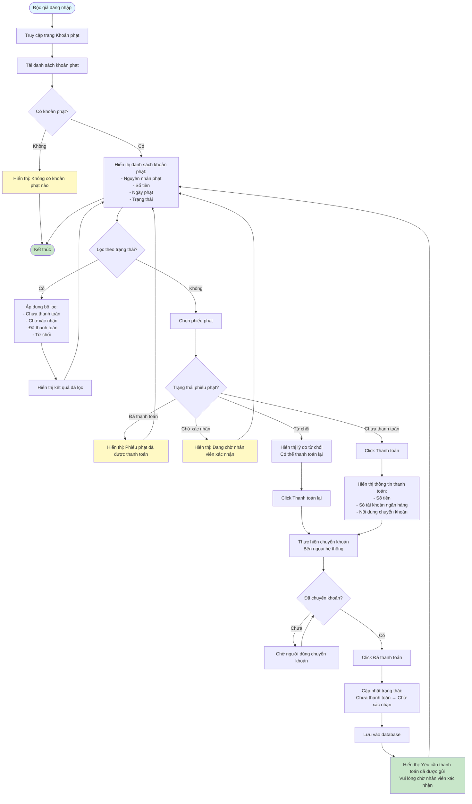

# Feature 2.5.2: Xem & Thanh Toán Phạt - Độc Giả (View & Pay Fine - Reader)

## Mô tả
Tính năng cho phép độc giả xem danh sách khoản phạt và thanh toán phạt.

## Actor
Độc giả

## Phụ thuộc
- 2.1.2 (Cần đăng nhập)
- 2.4.2 (Cần có phiếu phạt)
- 2.5.1 (Cần có mức phạt)

## Flowchart

## Thông tin hiển thị
- Danh sách khoản phạt chưa thanh toán
- Nguyên nhân phạt, Số tiền, Ngày phạt, Trạng thái

## Edge Cases
- Phiếu phạt đã hết hạn → Có thể hiển thị cảnh báo
- Nhiều phiếu phạt chưa thanh toán → Hiển thị tổng số tiền
- Phiếu phạt đã thanh toán → Không hiển thị nút thanh toán
- Phiếu phạt bị từ chối → Cho phép thanh toán lại

