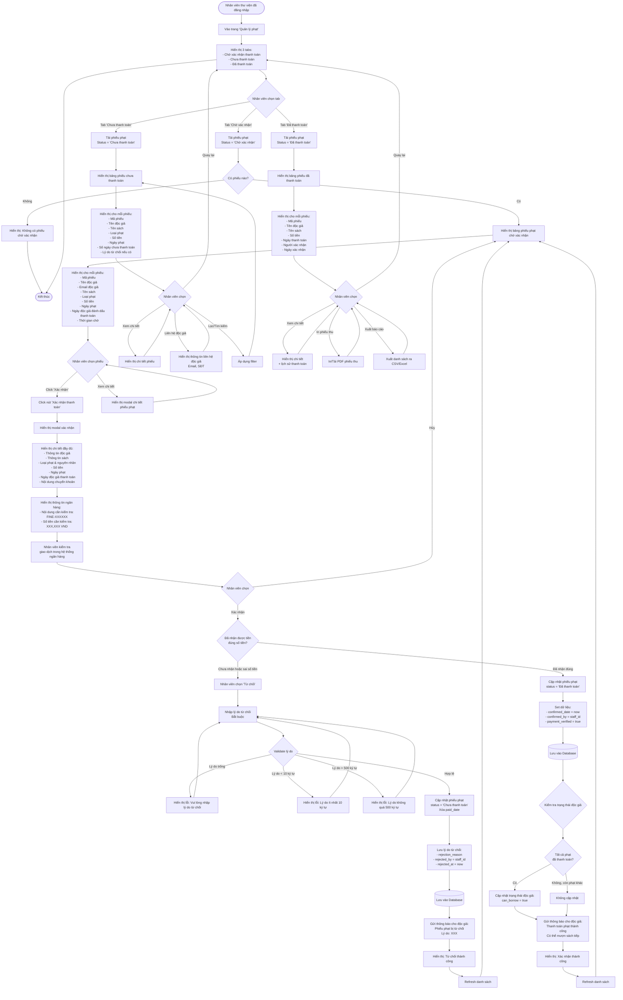

# Feature 2.5.3: Xem & Xác Nhận Thanh Toán Phạt (Nhân Viên)

## Mô tả
Cho phép nhân viên thư viện xem danh sách phiếu phạt chờ xác nhận thanh toán, kiểm tra giao dịch ngân hàng và xác nhận hoặc từ chối.

## Actor
Nhân viên thư viện, Admin

## Yêu cầu
- Đã đăng nhập (Feature 2.1.2)
- Có vai trò Librarian hoặc Admin
- Độc giả đã đánh dấu thanh toán (Feature 2.5.2)

## Flowchart



## Business Rules

### Xác Nhận Thanh Toán
1. ✅ Nhân viên phải kiểm tra giao dịch ngân hàng
2. ✅ Nội dung chuyển khoản phải chính xác: `FINE-{ID}`
3. ✅ Số tiền phải đúng với số tiền phạt
4. ✅ Sau khi xác nhận → Độc giả có thể mượn sách (nếu hết phạt)

### Từ Chối Thanh Toán
1. ✅ Phải nhập lý do từ chối (10-500 ký tự)
2. ✅ Phiếu phạt quay về trạng thái "Chưa thanh toán"
3. ✅ Xóa thông tin `paid_date`
4. ✅ Độc giả nhận thông báo kèm lý do

### Lý Do Từ Chối Thường Gặp
- "Chưa nhận được chuyển khoản"
- "Số tiền chuyển khoản không đúng (thiếu XXX VND)"
- "Nội dung chuyển khoản không đúng"
- "Chuyển khoản vào sai tài khoản"

## Validation Rules

### Xác Nhận
| Check | Rule | Action |
|-------|------|--------|
| Phiếu phạt | Status = 'Chờ xác nhận' | Block nếu khác |
| Giao dịch ngân hàng | Đã nhận tiền | Xác nhận bằng mắt/hệ thống |
| Số tiền | Đúng với amount | Cần match |

### Từ Chối
| Field | Rule | Message Error |
|-------|------|---------------|
| Lý do | Không được trống | "Vui lòng nhập lý do từ chối" |
| Lý do | Tối thiểu 10 ký tự | "Lý do phải ít nhất 10 ký tự" |
| Lý do | Tối đa 500 ký tự | "Lý do không được vượt quá 500 ký tự" |

## Data Model - Update on Confirm
```json
{
  "status": "Đã thanh toán",
  "confirmed_date": "timestamp (now)",
  "confirmed_by": "staff_id",
  "payment_verified": true,
  "updated_at": "timestamp"
}
```

## Data Model - Update on Reject
```json
{
  "status": "Chưa thanh toán",
  "paid_date": null,
  "payment_method": null,
  "rejection_reason": "string (10-500 chars)",
  "rejected_by": "staff_id",
  "rejected_at": "timestamp",
  "rejection_count": "number (increment)",
  "updated_at": "timestamp"
}
```

## Display Information

### Tab: Chờ Xác Nhận
```json
{
  "fine_code": "FINE-XXXXXX",
  "reader_name": "string",
  "reader_email": "string",
  "book_title": "string",
  "fine_type": "string",
  "amount": "number",
  "fine_date": "date",
  "paid_date": "date",
  "waiting_hours": "number",
  "transfer_content": "FINE-XXXXXX",
  "status": "Chờ xác nhận"
}
```

### Tab: Chưa Thanh Toán
```json
{
  "fine_code": "FINE-XXXXXX",
  "reader_name": "string",
  "reader_contact": "email, phone",
  "book_title": "string",
  "fine_type": "string",
  "amount": "number",
  "fine_date": "date",
  "unpaid_days": "number",
  "rejection_reason": "string (nullable)",
  "status": "Chưa thanh toán"
}
```

### Tab: Đã Thanh Toán
```json
{
  "fine_code": "FINE-XXXXXX",
  "reader_name": "string",
  "book_title": "string",
  "amount": "number",
  "fine_date": "date",
  "paid_date": "date",
  "confirmed_date": "date",
  "confirmed_by": "staff_name",
  "status": "Đã thanh toán"
}
```

## Bank Verification Display
```
🏦 Thông tin cần kiểm tra

Nội dung CK: FINE-123456
Số tiền: 50,000 VND
Thời gian độc giả đánh dấu: 2024-01-15 10:30

⚠️ Vui lòng kiểm tra trong hệ thống ngân hàng:
1. Tìm giao dịch với nội dung: FINE-123456
2. Kiểm tra số tiền: 50,000 VND
3. Xác nhận thời gian giao dịch gần với thời gian đánh dấu
```

## Notifications

### Khi Xác Nhận Thanh Toán
**Tới độc giả:**
- Tiêu đề: "Đã xác nhận thanh toán phạt"
- Nội dung:
  - Phiếu phạt FINE-XXXXXX đã được xác nhận thanh toán
  - Số tiền: XXX VND
  - Bạn có thể mượn sách tiếp (nếu hết phạt)

### Khi Từ Chối
**Tới độc giả:**
- Tiêu đề: "Thanh toán phạt bị từ chối"
- Nội dung:
  - Phiếu phạt FINE-XXXXXX bị từ chối
  - Lý do: {rejection_reason}
  - Vui lòng kiểm tra và thanh toán lại

## UI Components
- Tabs navigation
- Table với sorting & filtering
- Modal cho confirm/reject/detail
- Bank info display panel
- Action buttons (Confirm/Reject/Detail)
- Badge cho status & fine type
- Search & filter bar
- Export CSV/Excel button
- Print receipt button

## Statistics Display
```
📊 Thống kê nhanh

Chờ xác nhận: 5 phiếu | 250,000 VND
Chưa thanh toán: 12 phiếu | 600,000 VND
Đã thanh toán (tháng này): 45 phiếu | 2,250,000 VND
```

## Notes
- Nhân viên nên kiểm tra giao dịch trong hệ thống ngân hàng
- Có thể tích hợp API ngân hàng để tự động đối soát (future)
- Tab mặc định là "Chờ xác nhận"
- Hiển thị số lượng phiếu ở mỗi tab
- Có thể sort theo: ngày, số tiền, độc giả
- Filter theo: loại phạt, khoảng thời gian, độc giả
- Export CSV/Excel cho báo cáo

