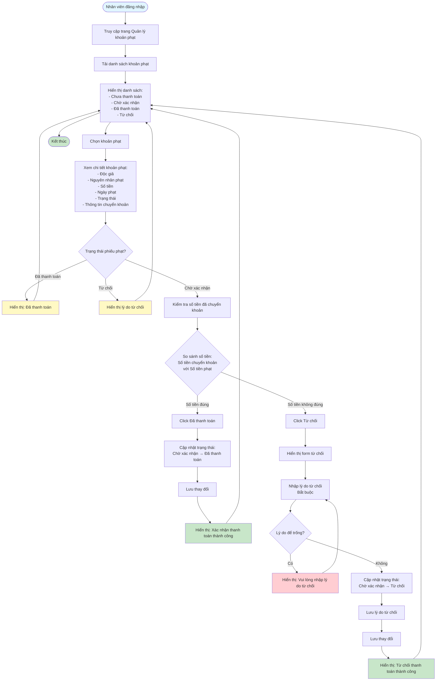

# Feature 2.5.3: Xem & Thanh Toán Phạt - Nhân Viên (View & Pay Fine - Librarian)

## Mô tả
Tính năng cho phép nhân viên thư viện xem và xác nhận/từ chối thanh toán phạt từ độc giả.

## Actor
Nhân viên thư viện

## Phụ thuộc
- 2.1.2 (Cần đăng nhập)
- 2.5.2 (Cần có phiếu phạt chờ xác nhận)

## Flowchart

## Validation Rules
- **Lý do từ chối:** Bắt buộc phải nhập

## Edge Cases
- Phiếu phạt đã được xử lý → Không cho phép xác nhận/từ chối lại
- Số tiền thừa → Có thể chấp nhận hoặc từ chối
- Số tiền thiếu → Từ chối và yêu cầu thanh toán lại
- Lý do từ chối để trống → Yêu cầu nhập lý do

