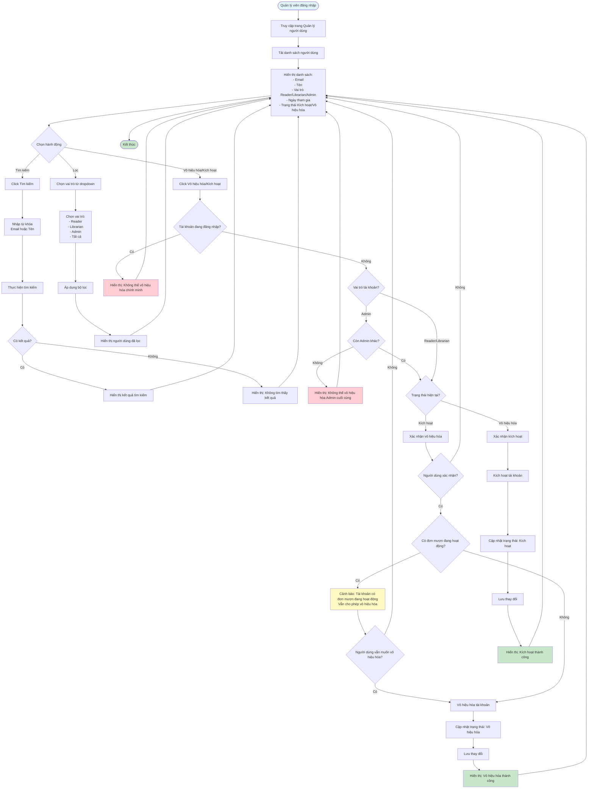

# Feature 2.6.1: Danh Sách Người Dùng (User List)

## Mô tả
Tính năng cho phép quản lý viên xem danh sách người dùng, tìm kiếm, lọc, và quản lý trạng thái tài khoản.

## Actor
Quản lý viên

## Phụ thuộc
- 2.1.2 (Cần đăng nhập với vai trò quản lý viên)

## Flowchart

## Chức năng
- Tìm kiếm theo email/tên
- Lọc theo vai trò
- Vô hiệu hóa/Kích hoạt tài khoản

## Edge Cases
- Tài khoản đang đăng nhập → Không cho phép vô hiệu hóa chính mình
- Tài khoản quản lý viên → Có thể ngăn chặn vô hiệu hóa Admin cuối cùng
- Tài khoản có đơn mượn đang hoạt động → Cảnh báo trước khi vô hiệu hóa
- Không có kết quả tìm kiếm → Hiển thị thông báo

