# Feature 2.6.1: Danh Sách Người Dùng

## Mô tả
Cho phép quản lý viên xem, tìm kiếm, lọc danh sách người dùng và vô hiệu hóa/kích hoạt tài khoản.

## Actor
Quản lý viên (Admin)

## Yêu cầu
- Đã đăng nhập (Feature 2.1.2)
- Có vai trò Admin

## Flowchart

```mermaid
flowchart TD
    Start([Admin đã đăng nhập]) --> ClickUserManagement[Click 'Quản lý người dùng']
    ClickUserManagement --> LoadUsers[Tải danh sách người dùng từ Database]
    
    LoadUsers --> DisplayTable[Hiển thị bảng danh sách người dùng<br/>Phân trang: 20 users/trang]
    DisplayTable --> ShowColumns[Hiển thị các cột:<br/>- Avatar<br/>- Tên<br/>- Email<br/>- Vai trò<br/>- Ngày tham gia<br/>- Trạng thái<br/>- Số sách đang mượn<br/>- Actions]
    
    ShowColumns --> ShowStats[Hiển thị thống kê:<br/>- Tổng số người dùng<br/>- Readers: X<br/>- Librarians: Y<br/>- Admins: Z<br/>- Hoạt động: A<br/>- Vô hiệu: B]
    
    ShowStats --> AdminAction{Admin chọn}
    
    %% ============ LUỒNG TÌM KIẾM ============
    AdminAction -->|Tìm kiếm| InputSearch[Nhập từ khóa:<br/>Email hoặc Tên]
    InputSearch --> ClickSearch[Click 'Tìm kiếm' hoặc Enter]
    ClickSearch --> SearchUsers[Tìm kiếm trong Database<br/>Pattern: LIKE %keyword%]
    SearchUsers --> CheckSearchResult{Có kết quả?}
    
    CheckSearchResult -->|Không| ShowNoResult[Hiển thị: Không tìm thấy người dùng]
    ShowNoResult --> AdminAction
    CheckSearchResult -->|Có| DisplaySearchResult[Hiển thị danh sách tìm được]
    DisplaySearchResult --> AdminAction
    
    %% ============ LUỒNG LỌC THEO VAI TRÒ ============
    AdminAction -->|Lọc theo vai trò| SelectRole{Chọn vai trò}
    SelectRole -->|Tất cả| FilterAll[Hiển thị tất cả người dùng]
    SelectRole -->|Reader| FilterReader[Hiển thị chỉ độc giả]
    SelectRole -->|Librarian| FilterLibrarian[Hiển thị chỉ nhân viên thư viện]
    SelectRole -->|Admin| FilterAdmin[Hiển thị chỉ quản lý viên]
    
    FilterAll --> ApplyFilter[Áp dụng filter]
    FilterReader --> ApplyFilter
    FilterLibrarian --> ApplyFilter
    FilterAdmin --> ApplyFilter
    ApplyFilter --> DisplayTable
    
    %% ============ LUỒNG LỌC THEO TRẠNG THÁI ============
    AdminAction -->|Lọc theo trạng thái| SelectStatus{Chọn trạng thái}
    SelectStatus -->|Tất cả| StatusAll[Hiển thị tất cả]
    SelectStatus -->|Hoạt động| StatusActive[Hiển thị người dùng hoạt động]
    SelectStatus -->|Vô hiệu hóa| StatusDisabled[Hiển thị người dùng bị vô hiệu]
    
    StatusAll --> ApplyStatusFilter[Áp dụng filter]
    StatusActive --> ApplyStatusFilter
    StatusDisabled --> ApplyStatusFilter
    ApplyStatusFilter --> DisplayTable
    
    %% ============ LUỒNG VÔ HIỆU HÓA TÀI KHOẢN ============
    AdminAction -->|Vô hiệu hóa| ClickDisable[Click nút 'Vô hiệu hóa']
    ClickDisable --> CheckUserRole{Kiểm tra vai trò user}
    CheckUserRole -->|Là Admin khác| CheckAdminCount{Còn admin khác?}
    CheckAdminCount -->|Không, chỉ còn 1 admin| ErrorLastAdmin[Hiển thị lỗi:<br/>Không thể vô hiệu hóa<br/>Phải có ít nhất 1 admin hoạt động]
    ErrorLastAdmin --> AdminAction
    CheckAdminCount -->|Có, còn admin khác| ShowDisableConfirm
    CheckUserRole -->|Là Reader/Librarian| ShowDisableConfirm[Hiển thị modal xác nhận vô hiệu hóa]
    
    ShowDisableConfirm --> DisplayUserInfo1[Hiển thị thông tin user:<br/>- Tên, Email, Vai trò<br/>- Số sách đang mượn<br/>- Phạt chưa thanh toán]
    DisplayUserInfo1 --> CheckBorrowingBooks{User đang mượn sách?}
    
    CheckBorrowingBooks -->|Có| ShowWarning1[Hiển thị cảnh báo:<br/>⚠️ User đang mượn X cuốn sách<br/>Vẫn muốn vô hiệu hóa?]
    ShowWarning1 --> DisableChoice1
    CheckBorrowingBooks -->|Không| DisableChoice1{Admin chọn}
    
    DisableChoice1 -->|Hủy| AdminAction
    DisableChoice1 -->|Xác nhận| InputDisableReason[Nhập lý do vô hiệu hóa<br/>Không bắt buộc]
    InputDisableReason --> UpdateDisable[Cập nhật user:<br/>- status = 'Vô hiệu hóa'<br/>- disabled_reason<br/>- disabled_by = admin_id<br/>- disabled_at = now]
    
    UpdateDisable --> SaveDisable[(Lưu vào Database)]
    SaveDisable --> RevokeSession[Thu hồi session/token của user]
    RevokeSession --> NotifyUserDisabled[Gửi email thông báo:<br/>Tài khoản bị vô hiệu hóa]
    NotifyUserDisabled --> ShowSuccessDisable[Hiển thị: Vô hiệu hóa thành công]
    ShowSuccessDisable --> RefreshList1[Refresh danh sách]
    RefreshList1 --> DisplayTable
    
    %% ============ LUỒNG KÍCH HOẠT TÀI KHOẢN ============
    AdminAction -->|Kích hoạt| ClickEnable[Click nút 'Kích hoạt']
    ClickEnable --> ShowEnableConfirm[Hiển thị modal xác nhận kích hoạt]
    ShowEnableConfirm --> DisplayUserInfo2[Hiển thị thông tin user:<br/>- Tên, Email, Vai trò<br/>- Lý do vô hiệu hóa trước đó<br/>- Ngày vô hiệu hóa]
    
    DisplayUserInfo2 --> EnableChoice{Admin chọn}
    EnableChoice -->|Hủy| AdminAction
    EnableChoice -->|Xác nhận| UpdateEnable[Cập nhật user:<br/>- status = 'Kích hoạt'<br/>- enabled_by = admin_id<br/>- enabled_at = now]
    
    UpdateEnable --> SaveEnable[(Lưu vào Database)]
    SaveEnable --> NotifyUserEnabled[Gửi email thông báo:<br/>Tài khoản đã được kích hoạt]
    NotifyUserEnabled --> ShowSuccessEnable[Hiển thị: Kích hoạt thành công]
    ShowSuccessEnable --> RefreshList2[Refresh danh sách]
    RefreshList2 --> DisplayTable
    
    %% ============ LUỒNG XEM CHI TIẾT ============
    AdminAction -->|Xem chi tiết| ClickDetail[Click vào user hoặc nút 'Chi tiết']
    ClickDetail --> ShowDetailModal[Hiển thị modal chi tiết user]
    ShowDetailModal --> DisplayFullInfo[Hiển thị thông tin đầy đủ:<br/>- Thông tin cá nhân<br/>- Vai trò & quyền<br/>- Ngày tham gia<br/>- Trạng thái<br/>- Số sách đang mượn<br/>- Tổng lần mượn<br/>- Tổng phạt<br/>- Lịch sử mượn gần đây<br/>- Lịch sử thay đổi vai trò]
    
    DisplayFullInfo --> DetailAction{Admin chọn}
    DetailAction -->|Gán vai trò| RedirectAssignRole[Chuyển đến Feature 2.6.2]
    DetailAction -->|Đóng| AdminAction
    RedirectAssignRole --> End([Kết thúc])
    
    %% ============ LUỒNG SẮP XẾP ============
    AdminAction -->|Sắp xếp| SelectSort{Chọn kiểu sắp xếp}
    SelectSort -->|Tên A-Z| SortNameAsc[Sắp xếp theo tên tăng dần]
    SelectSort -->|Tên Z-A| SortNameDesc[Sắp xếp theo tên giảm dần]
    SelectSort -->|Ngày tham gia Mới nhất| SortDateDesc[Sắp xếp theo ngày giảm dần]
    SelectSort -->|Ngày tham gia Cũ nhất| SortDateAsc[Sắp xếp theo ngày tăng dần]
    SelectSort -->|Số sách đang mượn| SortBorrowing[Sắp xếp theo số sách mượn]
    
    SortNameAsc --> ApplySort[Áp dụng sắp xếp]
    SortNameDesc --> ApplySort
    SortDateDesc --> ApplySort
    SortDateAsc --> ApplySort
    SortBorrowing --> ApplySort
    ApplySort --> DisplayTable
    
    %% ============ LUỒNG PHÂN TRANG ============
    AdminAction -->|Chuyển trang| SelectPage{Chọn trang}
    SelectPage -->|Trang trước| LoadPrevPage[Tải trang trước]
    SelectPage -->|Trang sau| LoadNextPage[Tải trang tiếp]
    SelectPage -->|Trang cụ thể| LoadSpecificPage[Tải trang được chọn]
    LoadPrevPage --> DisplayTable
    LoadNextPage --> DisplayTable
    LoadSpecificPage --> DisplayTable
    
    AdminAction -->|Thoát| End
```



## Business Rules

### Vô Hiệu Hóa Tài Khoản
- ❌ Không thể vô hiệu hóa admin cuối cùng
- ⚠️ Cảnh báo nếu user đang mượn sách
- ✅ Thu hồi session/token ngay lập tức
- ✅ User không thể đăng nhập sau khi bị vô hiệu hóa

### Kích Hoạt Tài Khoản
- ✅ Có thể kích hoạt lại bất kỳ lúc nào
- ✅ User có thể đăng nhập ngay sau khi kích hoạt
- ✅ Lịch sử mượn/phạt vẫn giữ nguyên

### Phân Quyền
- Chỉ Admin mới có quyền vô hiệu hóa/kích hoạt
- Admin có thể vô hiệu hóa admin khác (nếu không phải admin cuối cùng)

## Display Information

Mỗi user trong bảng hiển thị:

| Column | Description |
|--------|-------------|
| Avatar | Ảnh đại diện (hoặc initial) |
| Tên | Full name |
| Email | Email address |
| Vai trò | Badge: Reader / Librarian / Admin |
| Ngày tham gia | Join date |
| Trạng thái | Badge: Hoạt động / Vô hiệu hóa |
| Số sách đang mượn | Count |
| Tổng phạt | Total fine amount (VND) |
| Actions | Buttons: Chi tiết / Gán vai trò / Vô hiệu/Kích hoạt |

## Validation Rules

| Action | Condition | Message Error |
|--------|-----------|---------------|
| Vô hiệu hóa Admin | Phải còn ít nhất 1 admin khác hoạt động | "Không thể vô hiệu hóa admin cuối cùng" |
| Vô hiệu hóa chính mình | Không thể tự vô hiệu hóa | "Không thể vô hiệu hóa chính mình" |

## Data Model - Update on Disable
```json
{
  "status": "Vô hiệu hóa",
  "disabled_reason": "string (nullable)",
  "disabled_by": "admin_id",
  "disabled_at": "timestamp",
  "updated_at": "timestamp"
}
```

## Data Model - Update on Enable
```json
{
  "status": "Kích hoạt",
  "enabled_by": "admin_id",
  "enabled_at": "timestamp",
  "updated_at": "timestamp"
}
```

## Statistics Display
```json
{
  "total_users": "number",
  "readers": "number",
  "librarians": "number",
  "admins": "number",
  "active_users": "number",
  "disabled_users": "number"
}
```

## Notifications

### Khi Vô Hiệu Hóa
**Tới user:**
- Tiêu đề: "Tài khoản đã bị vô hiệu hóa"
- Nội dung:
  - Tài khoản của bạn đã bị vô hiệu hóa
  - Lý do: {reason}
  - Liên hệ admin để biết thêm chi tiết

### Khi Kích Hoạt
**Tới user:**
- Tiêu đề: "Tài khoản đã được kích hoạt"
- Nội dung:
  - Tài khoản của bạn đã được kích hoạt lại
  - Bạn có thể đăng nhập và sử dụng dịch vụ

## UI Features

### Badges
- 🔵 **Reader** (xanh dương)
- 🟣 **Librarian** (tím)
- 🔴 **Admin** (đỏ)
- 🟢 **Hoạt động** (xanh lá)
- ⚫ **Vô hiệu hóa** (xám)

### Filter & Search Bar
```
┌─────────────────────────────────────────────────────┐
│ [🔍 Tìm theo tên/email]  [Vai trò ▼]  [Trạng thái ▼] │
└─────────────────────────────────────────────────────┘
```

### Statistics Cards
```
┌──────────────────┐ ┌──────────────────┐ ┌──────────────────┐
│ 👥 Tổng          │ │ 📖 Độc giả      │ │ ✅ Hoạt động     │
│    150 users     │ │    130 users    │ │    145 users    │
└──────────────────┘ └──────────────────┘ └──────────────────┘
```

## Notes
- Phân trang: 20 users/trang
- Có thể export danh sách ra CSV/Excel
- Session của user bị vô hiệu hóa ngay lập tức
- Admin không thể vô hiệu hóa chính mình
- Lịch sử vô hiệu hóa/kích hoạt được ghi log
- Có thể thêm tính năng bulk actions (vô hiệu hóa nhiều user)

