# Feature 2.6.2: Gán Vai Trò

## Mô tả
Cho phép quản lý viên thay đổi vai trò của người dùng trong hệ thống (Reader, Librarian, Admin).

## Actor
Quản lý viên (Admin)

## Yêu cầu
- Đã đăng nhập (Feature 2.1.2)
- Có vai trò Admin
- Có danh sách người dùng (Feature 2.6.1)

## Flowchart

```mermaid
flowchart TD
    Start([Admin đã đăng nhập]) --> AccessUser[Từ trang danh sách người dùng<br/>hoặc chi tiết user]
    AccessUser --> ClickAssignRole[Click 'Gán vai trò']
    
    ClickAssignRole --> LoadUserInfo[Tải thông tin user hiện tại]
    LoadUserInfo --> ShowAssignModal[Hiển thị modal gán vai trò]
    
    ShowAssignModal --> DisplayUserInfo[Hiển thị thông tin user:<br/>- Tên, Email<br/>- Vai trò hiện tại<br/>- Ngày tham gia<br/>- Số sách đang mượn]
    
    DisplayUserInfo --> CheckCurrentRole{Kiểm tra vai trò hiện tại}
    
    CheckCurrentRole --> ShowRoleOptions[Hiển thị 3 tùy chọn vai trò:<br/>○ Reader: Chỉ mượn sách<br/>○ Librarian: Quản lý sách, mượn trả<br/>○ Admin: Toàn quyền]
    
    ShowRoleOptions --> ShowCurrentRole[Highlight vai trò hiện tại]
    ShowCurrentRole --> AdminSelectRole[Admin chọn vai trò mới]
    
    AdminSelectRole --> RoleChoice{Vai trò được chọn}
    
    %% ============ LUỒNG GÁN READER ============
    RoleChoice -->|Reader| CheckIsReader{Đã là Reader?}
    CheckIsReader -->|Rồi| ErrorSameRole1[Hiển thị thông báo:<br/>User đã là Reader]
    ErrorSameRole1 --> AdminSelectRole
    CheckIsReader -->|Chưa| ShowReaderInfo[Hiển thị mô tả Reader:<br/>- Chỉ có thể mượn sách<br/>- Xem lịch sử cá nhân<br/>- Thanh toán phạt]
    ShowReaderInfo --> ConfirmReader
    
    %% ============ LUỒNG GÁN LIBRARIAN ============
    RoleChoice -->|Librarian| CheckIsLibrarian{Đã là Librarian?}
    CheckIsLibrarian -->|Rồi| ErrorSameRole2[Hiển thị thông báo:<br/>User đã là Librarian]
    ErrorSameRole2 --> AdminSelectRole
    CheckIsLibrarian -->|Chưa| ShowLibrarianInfo[Hiển thị mô tả Librarian:<br/>- Quản lý sách thể loại<br/>- Xác nhận mượn/trả<br/>- Xử lý phạt<br/>- Xem báo cáo]
    ShowLibrarianInfo --> ConfirmLibrarian
    
    %% ============ LUỒNG GÁN ADMIN ============
    RoleChoice -->|Admin| CheckIsAdmin{Đã là Admin?}
    CheckIsAdmin -->|Rồi| ErrorSameRole3[Hiển thị thông báo:<br/>User đã là Admin]
    ErrorSameRole3 --> AdminSelectRole
    CheckIsAdmin -->|Chưa| ShowAdminWarning[Hiển thị cảnh báo:<br/>⚠️ Vai trò Admin có toàn quyền<br/>- Quản lý người dùng<br/>- Cấu hình hệ thống<br/>- Xem tất cả báo cáo<br/>- Gán vai trò<br/>Bạn có chắc chắn?]
    ShowAdminWarning --> ConfirmAdmin
    
    %% ============ XÁC NHẬN GÁN READER ============
    ConfirmReader{Admin xác nhận?}
    ConfirmReader -->|Hủy| AdminSelectRole
    ConfirmReader -->|Xác nhận| CheckBorrowingReader{User đang mượn sách<br/>hoặc có phạt?}
    CheckBorrowingReader -->|Có| ShowWarningReader[Hiển thị thông tin:<br/>ℹ️ User đang mượn X sách<br/>Có Y VND phạt chưa thanh toán<br/>Vẫn có thể gán Reader]
    ShowWarningReader --> UpdateToReader
    CheckBorrowingReader -->|Không| UpdateToReader[Cập nhật vai trò = Reader]
    
    %% ============ XÁC NHẬN GÁN LIBRARIAN ============
    ConfirmLibrarian{Admin xác nhận?}
    ConfirmLibrarian -->|Hủy| AdminSelectRole
    ConfirmLibrarian -->|Xác nhận| CheckBorrowingLibrarian{User đang mượn sách?}
    CheckBorrowingLibrarian -->|Có| ShowInfoLibrarian[Hiển thị thông tin:<br/>ℹ️ Librarian vẫn có thể mượn sách<br/>User đang mượn X sách]
    ShowInfoLibrarian --> UpdateToLibrarian
    CheckBorrowingLibrarian -->|Không| UpdateToLibrarian[Cập nhật vai trò = Librarian]
    
    %% ============ XÁC NHẬN GÁN ADMIN ============
    ConfirmAdmin{Admin xác nhận?}
    ConfirmAdmin -->|Hủy| AdminSelectRole
    ConfirmAdmin -->|Xác nhận hai lần| ShowFinalConfirm[Hiển thị xác nhận cuối:<br/>Bạn thực sự muốn gán<br/>vai trò Admin cho user này?]
    ShowFinalConfirm --> FinalChoice{Admin chọn}
    FinalChoice -->|Hủy| AdminSelectRole
    FinalChoice -->|Xác nhận| InputReason[Nhập lý do gán Admin<br/>Bắt buộc]
    
    InputReason --> ValidateReason{Validate lý do}
    ValidateReason -->|Lý do trống| ErrorEmptyReason[Hiển thị lỗi: Vui lòng nhập lý do]
    ErrorEmptyReason --> InputReason
    ValidateReason -->|Lý do < 10 ký tự| ErrorShortReason[Hiển thị lỗi: Lý do ít nhất 10 ký tự]
    ErrorShortReason --> InputReason
    ValidateReason -->|Hợp lệ| UpdateToAdmin[Cập nhật vai trò = Admin]
    
    %% ============ LƯU VÀO DATABASE ============
    UpdateToReader --> SetUpdateData[Set dữ liệu cập nhật:<br/>- role<br/>- role_updated_by = admin_id<br/>- role_updated_at = now<br/>- role_change_reason nullable]
    UpdateToLibrarian --> SetUpdateData
    UpdateToAdmin --> SetUpdateData
    
    SetUpdateData --> SaveRole[(Lưu vào Database)]
    SaveRole --> LogRoleChange[Ghi log thay đổi vai trò:<br/>- user_id<br/>- old_role<br/>- new_role<br/>- changed_by<br/>- reason<br/>- timestamp]
    
    LogRoleChange --> RevokeSession[Thu hồi session/token hiện tại<br/>User cần đăng nhập lại]
    RevokeSession --> NotifyUser[Gửi email thông báo:<br/>Vai trò đã được thay đổi<br/>Vui lòng đăng nhập lại]
    NotifyUser --> ShowSuccess[Hiển thị: Gán vai trò thành công]
    
    ShowSuccess --> ShowNextAction[Hiển thị hướng dẫn:<br/>User cần đăng nhập lại<br/>để quyền có hiệu lực]
    
    ShowNextAction --> AdminNextChoice{Admin chọn}
    AdminNextChoice -->|Về danh sách user| RedirectUserList[Chuyển về danh sách người dùng]
    AdminNextChoice -->|Xem chi tiết user| RefreshUserDetail[Refresh trang chi tiết user]
    AdminNextChoice -->|Đóng| CloseModal[Đóng modal]
    
    RedirectUserList --> End([Kết thúc])
    RefreshUserDetail --> End
    CloseModal --> End
```



## Business Rules

### Vai Trò Trong Hệ Thống

#### Reader (Độc giả)
- ✅ Mượn sách, trả sách
- ✅ Xem lịch sử mượn cá nhân
- ✅ Thanh toán phạt
- ✅ Cập nhật hồ sơ cá nhân
- ❌ Không quản lý sách
- ❌ Không xác nhận mượn/trả
- ❌ Không xem báo cáo hệ thống

#### Librarian (Nhân viên thư viện)
- ✅ Tất cả quyền của Reader
- ✅ Quản lý sách và thể loại
- ✅ Xác nhận mượn sách
- ✅ Xác nhận trả sách
- ✅ Xác nhận thanh toán phạt
- ✅ Xem báo cáo
- ❌ Không quản lý người dùng
- ❌ Không gán vai trò
- ❌ Không cấu hình mức phạt

#### Admin (Quản lý viên)
- ✅ Tất cả quyền của Librarian
- ✅ Quản lý người dùng (vô hiệu/kích hoạt)
- ✅ Gán vai trò
- ✅ Quản lý mức phạt
- ✅ Xem tất cả báo cáo chi tiết
- ✅ Cấu hình hệ thống

### Quy Tắc Gán Vai Trò
- ✅ Admin có thể gán bất kỳ vai trò nào cho bất kỳ user nào (kể cả admin khác)
- ⚠️ Gán Admin cần lý do (audit trail)
- ⚠️ Gán Admin cần xác nhận 2 lần
- ✅ Sau khi thay đổi vai trò, user cần đăng nhập lại
- ✅ Lịch sử thay đổi vai trò được ghi log đầy đủ

## Validation Rules

| Action | Rule | Message Error |
|--------|------|---------------|
| Gán vai trò | Vai trò mới khác vai trò hiện tại | "User đã có vai trò này" |
| Gán Admin | Phải nhập lý do | "Vui lòng nhập lý do gán vai trò Admin" |
| Gán Admin | Lý do >= 10 ký tự | "Lý do phải ít nhất 10 ký tự" |
| Gán vai trò | User phải ở trạng thái kích hoạt | "Không thể gán vai trò cho tài khoản bị vô hiệu hóa" |

## Data Model - Update Role
```json
{
  "role": "Reader | Librarian | Admin",
  "role_updated_by": "admin_id",
  "role_updated_at": "timestamp",
  "role_change_reason": "string (required if promoting to Admin)",
  "updated_at": "timestamp"
}
```

## Data Model - Role Change Log
```json
{
  "id": "string (UUID)",
  "user_id": "string",
  "old_role": "string",
  "new_role": "string",
  "changed_by": "admin_id",
  "changed_by_name": "string",
  "reason": "string (nullable)",
  "timestamp": "timestamp"
}
```

## Display Information

### Modal Gán Vai Trò
```json
{
  "user": {
    "id": "string",
    "name": "string",
    "email": "string",
    "current_role": "Reader | Librarian | Admin",
    "joined_date": "date",
    "total_borrows": "number",
    "current_borrowed": "number"
  },
  "roles": [
    {
      "value": "Reader",
      "label": "Độc giả",
      "description": "Chỉ có thể mượn sách, xem lịch sử cá nhân",
      "permissions": ["borrow_books", "view_profile", "pay_fines"]
    },
    {
      "value": "Librarian",
      "label": "Nhân viên thư viện",
      "description": "Quản lý sách, xác nhận mượn/trả, theo dõi phạt",
      "permissions": ["all_reader_permissions", "manage_books", "confirm_borrow", "confirm_return", "view_reports"]
    },
    {
      "value": "Admin",
      "label": "Quản lý viên",
      "description": "Toàn quyền, quản lý tài khoản, báo cáo, cài đặt",
      "permissions": ["all_permissions"]
    }
  ]
}
```

## Notifications

### Khi Thay Đổi Vai Trò
**Tới user:**
- Tiêu đề: "Vai trò của bạn đã được thay đổi"
- Nội dung:
  - Vai trò cũ: {old_role}
  - Vai trò mới: {new_role}
  - Vui lòng đăng nhập lại để quyền có hiệu lực
  - Nếu gán Admin: Lý do: {reason}

### Khi Gán Admin (Audit)
**Tới tất cả Admin:**
- Tiêu đề: "User mới được gán vai trò Admin"
- Nội dung:
  - User: {name} ({email})
  - Gán bởi: {admin_name}
  - Lý do: {reason}
  - Thời gian: {timestamp}

## UI Components

### Role Selection
```
● Reader (current)
  Độc giả - Chỉ có thể mượn sách, xem lịch sử cá nhân
  
○ Librarian
  Nhân viên thư viện - Quản lý sách, xác nhận mượn/trả
  
○ Admin
  Quản lý viên - Toàn quyền ⚠️
```

### Permission Comparison Table
| Permission | Reader | Librarian | Admin |
|------------|--------|-----------|-------|
| Mượn sách | ✅ | ✅ | ✅ |
| Quản lý sách | ❌ | ✅ | ✅ |
| Xác nhận mượn/trả | ❌ | ✅ | ✅ |
| Xem báo cáo | ❌ | ✅ | ✅ |
| Quản lý người dùng | ❌ | ❌ | ✅ |
| Gán vai trò | ❌ | ❌ | ✅ |

## Notes
- Admin có thể gán vai trò cho chính mình (self-promotion)
- Gán Admin cần audit trail đầy đủ
- Session của user bị revoke ngay sau khi đổi vai trò
- User cần đăng nhập lại để có quyền mới
- Lịch sử đổi vai trò được lưu vĩnh viễn
- Có thể thêm approval workflow cho việc gán Admin (future)
- Có thể thêm custom roles/permissions (future)

