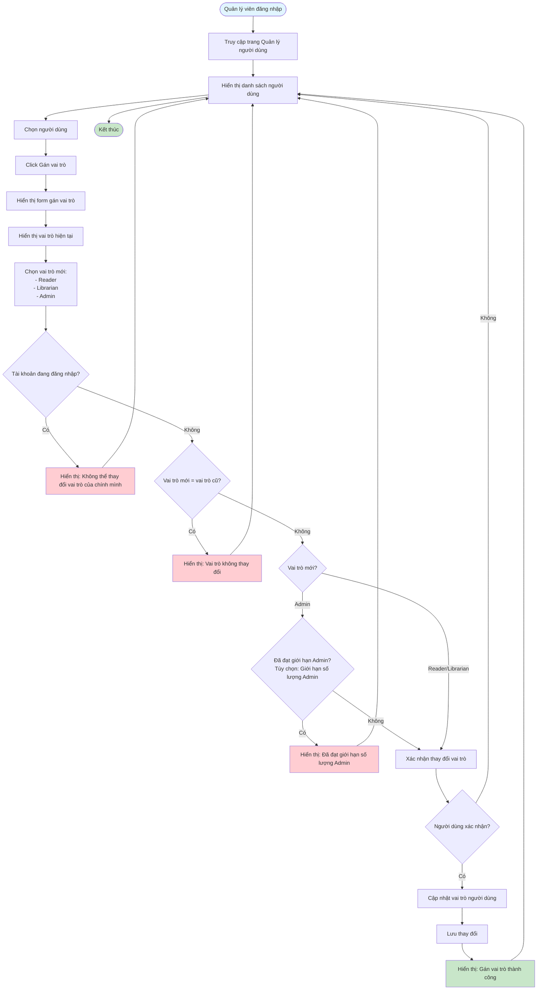

# Feature 2.6.2: Gán Vai Trò (Assign Role)

## Mô tả
Tính năng cho phép quản lý viên gán vai trò cho người dùng trong hệ thống.

## Actor
Quản lý viên

## Phụ thuộc
- 2.1.2 (Cần đăng nhập)
- 2.6.1 (Cần có danh sách người dùng)

## Flowchart

## Vai trò trong hệ thống
- **Reader:** Chỉ có thể mượn sách, xem lịch sử cá nhân
- **Librarian:** Có thể quản lý sách, xác nhận mượn/trả, theo dõi phạt
- **Admin:** Toàn quyền, quản lý tài khoản, báo cáo, cài đặt

## Edge Cases
- Gán vai trò Admin cho nhiều người → Có thể giới hạn số lượng Admin
- Thay đổi vai trò của chính mình → Ngăn chặn hoặc cảnh báo
- Vai trò không thay đổi → Không cần cập nhật

