# Feature 2.7.1: Báo Cáo Tổng Quan (Dashboard)

## Mô tả
Hiển thị dashboard tổng quan với các chỉ số quan trọng và thống kê nhanh về hoạt động của thư viện.

## Actor
Quản lý viên, Nhân viên thư viện

## Yêu cầu
- Đã đăng nhập (Feature 2.1.2)
- Có vai trò Librarian hoặc Admin
- Có dữ liệu sách, mượn trả (từ các features trước)

## Flowchart

```mermaid
flowchart TD
    Start([Nhân viên/Admin đăng nhập]) --> AccessDashboard[Vào trang Dashboard<br/>hoặc Trang chủ sau login]
    
    AccessDashboard --> LoadData[Tải dữ liệu thống kê từ Database]
    LoadData --> FetchBooks[Lấy thống kê sách]
    FetchBooks --> FetchUsers[Lấy thống kê người dùng]
    FetchUsers --> FetchBorrows[Lấy thống kê mượn trả]
    FetchBorrows --> FetchFines[Lấy thống kê phạt]
    FetchFines --> FetchOverdue[Lấy danh sách quá hạn]
    FetchOverdue --> FetchPopular[Lấy sách phổ biến]
    
    FetchPopular --> DisplayDashboard[Hiển thị Dashboard]
    
    DisplayDashboard --> Section1[SECTION 1: Thống Kê Sách]
    Section1 --> ShowBookStats[Hiển thị card statistics:<br/>- Tổng số sách<br/>- Có sẵn<br/>- Đang mượn<br/>- Bị mất<br/>- Hư hỏng]
    ShowBookStats --> ShowBookChart[Hiển thị biểu đồ tròn:<br/>Phân bố trạng thái sách]
    
    ShowBookChart --> Section2[SECTION 2: Thống Kê Độc Giả]
    Section2 --> ShowUserStats[Hiển thị card statistics:<br/>- Tổng độc giả<br/>- Hoạt động<br/>- Vô hiệu hóa<br/>- Độc giả đang mượn sách]
    ShowUserStats --> ShowUserChart[Hiển thị biểu đồ:<br/>Người dùng theo vai trò]
    
    ShowUserChart --> Section3[SECTION 3: Hoạt Động Hôm Nay]
    Section3 --> ShowTodayStats[Hiển thị card statistics:<br/>- Đơn mượn hôm nay<br/>- Đơn trả hôm nay<br/>- Đơn chờ xác nhận mượn<br/>- Đơn chờ xác nhận trả]
    ShowTodayStats --> ShowActivityChart[Hiển thị biểu đồ cột:<br/>Hoạt động 7 ngày gần đây]
    
    ShowActivityChart --> Section4[SECTION 4: Top 5 Sách Phổ Biến]
    Section4 --> ShowTopBooks[Hiển thị bảng Top 5:<br/>- Tên sách<br/>- Tác giả<br/>- Thể loại<br/>- Số lần mượn<br/>- Đang mượn]
    ShowTopBooks --> ShowTopBooksChart[Hiển thị biểu đồ thanh ngang:<br/>So sánh lượt mượn]
    
    ShowTopBooksChart --> Section5[SECTION 5: Độc Giả Nợ Quá Hạn]
    Section5 --> CheckOverdueReaders{Có độc giả<br/>nợ quá hạn?}
    CheckOverdueReaders -->|Không| ShowNoOverdue[Hiển thị: Không có độc giả nợ quá hạn ✓]
    CheckOverdueReaders -->|Có| ShowOverdueList[Hiển thị bảng độc giả quá hạn:<br/>- Tên độc giả<br/>- Email<br/>- Tên sách<br/>- Ngày hết hạn<br/>- Số ngày quá hạn<br/>- Phạt dự kiến]
    ShowOverdueList --> HighlightCritical[Highlight màu đỏ<br/>nếu quá hạn > 7 ngày]
    
    ShowNoOverdue --> Section6
    HighlightCritical --> Section6[SECTION 6: Thống Kê Phạt]
    Section6 --> ShowFineStats[Hiển thị card statistics:<br/>- Tổng phạt tháng này<br/>- Đã thanh toán<br/>- Chưa thanh toán<br/>- Chờ xác nhận]
    ShowFineStats --> ShowFineChart[Hiển thị biểu đồ cột:<br/>Doanh thu phạt theo tháng<br/>6 tháng gần đây]
    
    ShowFineChart --> Section7[SECTION 7: Quick Actions]
    Section7 --> ShowQuickActions[Hiển thị các nút nhanh:<br/>- Xác nhận mượn sách<br/>- Xác nhận trả sách<br/>- Xác nhận thanh toán phạt<br/>- Thêm sách mới<br/>- Xem báo cáo chi tiết]
    
    ShowQuickActions --> UserAction{Nhân viên/Admin thao tác}
    
    %% ============ ACTIONS ============
    UserAction -->|Click vào card| ViewDetail1[Xem chi tiết theo category]
    ViewDetail1 --> RedirectToFeature1[Chuyển đến feature tương ứng]
    RedirectToFeature1 --> End([Kết thúc])
    
    UserAction -->|Click vào sách Top 5| ViewBookDetail[Xem chi tiết sách]
    ViewBookDetail --> RedirectToFeature2[Chuyển đến trang chi tiết sách]
    RedirectToFeature2 --> End
    
    UserAction -->|Click vào độc giả quá hạn| ViewReaderDetail[Xem chi tiết độc giả]
    ViewReaderDetail --> ShowReaderModal[Hiển thị modal:<br/>- Thông tin độc giả<br/>- Danh sách sách quá hạn<br/>- Tổng phạt<br/>- Thông tin liên hệ]
    ShowReaderModal --> ModalAction{Nhân viên chọn}
    ModalAction -->|Liên hệ độc giả| ShowContact[Hiển thị email/SĐT]
    ModalAction -->|Xem lịch sử| RedirectHistory[Chuyển đến lịch sử mượn]
    ModalAction -->|Đóng| UserAction
    ShowContact --> UserAction
    RedirectHistory --> End
    
    UserAction -->|Click Quick Action| ExecuteQuickAction[Thực hiện action]
    ExecuteQuickAction --> RedirectToFeature3[Chuyển đến feature tương ứng]
    RedirectToFeature3 --> End
    
    UserAction -->|Refresh Dashboard| LoadData
    
    UserAction -->|Chọn khoảng thời gian| SelectDateRange{Chọn range}
    SelectDateRange -->|Hôm nay| FilterToday[Lọc dữ liệu hôm nay]
    SelectDateRange -->|Tuần này| FilterWeek[Lọc dữ liệu tuần này]
    SelectDateRange -->|Tháng này| FilterMonth[Lọc dữ liệu tháng này]
    SelectDateRange -->|Tùy chỉnh| FilterCustom[Chọn ngày bắt đầu & kết thúc]
    
    FilterToday --> LoadData
    FilterWeek --> LoadData
    FilterMonth --> LoadData
    FilterCustom --> LoadData
    
    UserAction -->|Thoát| End
```



## Display Information

### SECTION 1: Thống Kê Sách
```json
{
  "total_books": "number",
  "available": "number",
  "borrowed": "number",
  "lost": "number",
  "damaged": "number",
  "percentage_available": "number (%)"
}
```

### SECTION 2: Thống Kê Độc Giả
```json
{
  "total_readers": "number",
  "active": "number",
  "disabled": "number",
  "currently_borrowing": "number",
  "by_role": {
    "readers": "number",
    "librarians": "number",
    "admins": "number"
  }
}
```

### SECTION 3: Hoạt Động Hôm Nay
```json
{
  "today": {
    "new_borrow_requests": "number",
    "return_requests": "number",
    "pending_borrow_confirmations": "number",
    "pending_return_confirmations": "number"
  },
  "last_7_days": [
    {
      "date": "date",
      "borrows": "number",
      "returns": "number"
    }
  ]
}
```

### SECTION 4: Top 5 Sách Phổ Biến
```json
{
  "top_books": [
    {
      "rank": 1,
      "book_id": "string",
      "title": "string",
      "author": "string",
      "category": "string",
      "borrow_count": "number",
      "currently_borrowed": "number",
      "available": "number"
    }
  ]
}
```

### SECTION 5: Độc Giả Nợ Quá Hạn
```json
{
  "overdue_readers": [
    {
      "reader_id": "string",
      "reader_name": "string",
      "email": "string",
      "phone": "string",
      "book_title": "string",
      "due_date": "date",
      "overdue_days": "number",
      "estimated_fine": "number (VND)"
    }
  ],
  "total_overdue": "number"
}
```

### SECTION 6: Thống Kê Phạt
```json
{
  "current_month": {
    "total_fines": "number (VND)",
    "paid": "number (VND)",
    "unpaid": "number (VND)",
    "pending": "number (VND)"
  },
  "last_6_months": [
    {
      "month": "string (YYYY-MM)",
      "total": "number (VND)",
      "paid": "number (VND)"
    }
  ]
}
```

## UI Components

### Statistics Cards
```
┌─────────────────────┐
│ 📚 Tổng Số Sách    │
│                     │
│      1,250          │
│   ↑ 12% vs tháng trước │
└─────────────────────┘
```

### Charts
1. **Pie Chart:** Phân bố trạng thái sách
2. **Bar Chart:** Hoạt động 7 ngày
3. **Horizontal Bar:** Top 5 sách phổ biến
4. **Line Chart:** Doanh thu phạt 6 tháng

### Tables
1. **Top Books Table:** 5 rows
2. **Overdue Readers Table:** Có pagination nếu > 10

### Quick Actions
```
┌────────────────────────────────────┐
│ ⚡ Quick Actions                  │
├────────────────────────────────────┤
│ [✓ Xác nhận mượn (5)]             │
│ [↩ Xác nhận trả (3)]               │
│ [💰 Xác nhận thanh toán (2)]      │
│ [➕ Thêm sách mới]                │
│ [📊 Báo cáo chi tiết]             │
└────────────────────────────────────┘
```

## Features

### Real-time Updates
- Auto-refresh mỗi 5 phút (optional)
- Badge số lượng pending actions
- Highlight khi có action mới

### Interactive Elements
- Click vào card → Chi tiết
- Click vào chart → Filter data
- Click vào table row → Modal detail
- Hover → Tooltip với thông tin thêm

### Date Range Filter
- Hôm nay
- Tuần này
- Tháng này
- Tùy chỉnh (date picker)

### Responsive Design
- Desktop: Full layout với 2-3 columns
- Tablet: Stacked cards
- Mobile: Single column

## Color Coding

### Status Badges
- 🟢 Available / Active (xanh lá)
- 🟡 Pending (vàng)
- 🔴 Overdue / Urgent (đỏ)
- ⚫ Disabled / Lost (xám)
- 🔵 Borrowed (xanh dương)

### Overdue Days
- 1-3 ngày: 🟡 Cảnh báo
- 4-7 ngày: 🟠 Nghiêm trọng
- > 7 ngày: 🔴 Rất nghiêm trọng

## Performance Optimization
- Cache dữ liệu 5 phút
- Lazy load charts
- Pagination cho tables
- Aggregate queries
- Index database properly

## Notes
- Dashboard là trang đầu tiên sau khi login (cho Librarian/Admin)
- Dữ liệu được cache để tăng tốc
- Charts sử dụng Recharts library
- Responsive design cho mobile
- Export dashboard to PDF (future)
- Custom dashboard widgets (future)
- Real-time notifications với WebSocket (future)

