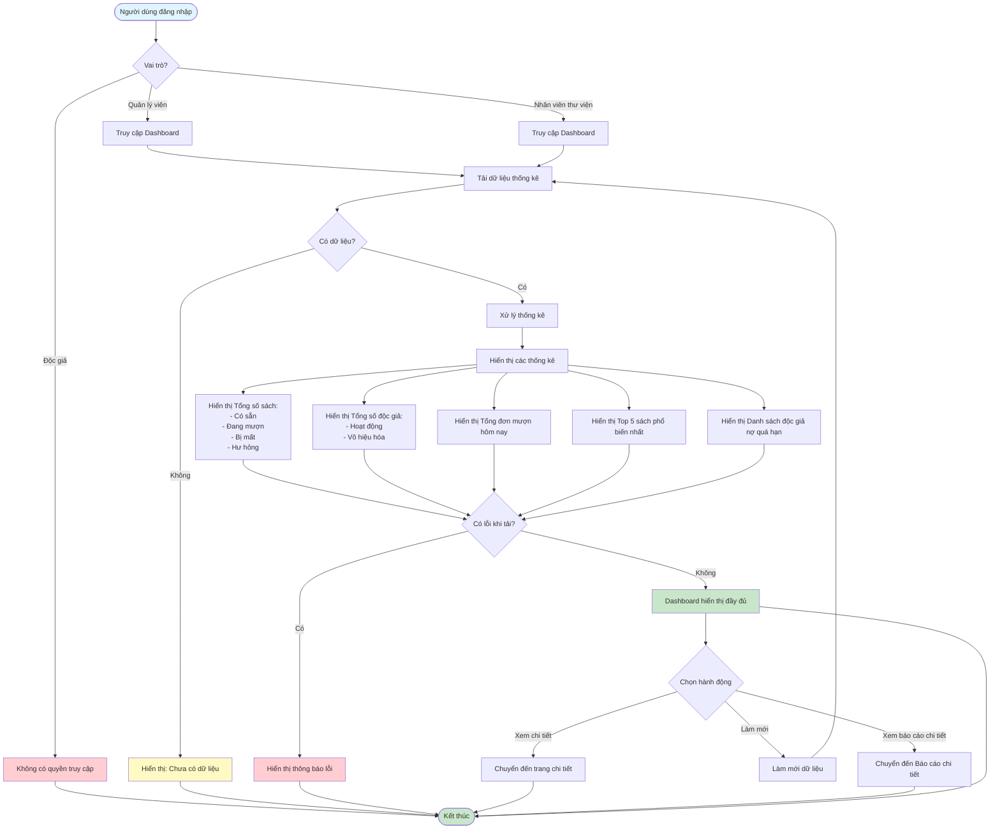

# Feature 2.7.1: Báo Cáo Tổng Quan - Dashboard

## Mô tả
Tính năng hiển thị dashboard với các thống kê tổng quan về hệ thống thư viện.

## Actor
Quản lý viên, Nhân viên thư viện

## Phụ thuộc
- 2.1.2 (Cần đăng nhập)
- 2.2.2 (Cần có dữ liệu sách)
- 2.3.1 (Cần có dữ liệu mượn)
- 2.4.2 (Cần có dữ liệu trả)

## Flowchart

## Thông tin hiển thị
- **Tổng số sách:** Có sẵn / Đang mượn / Bị mất / Hư hỏng
- **Tổng số độc giả:** Hoạt động / Vô hiệu hóa
- **Tổng đơn mượn hôm nay**
- **Top 5 sách phổ biến nhất**
- **Danh sách độc giả nợ quá hạn**

## Edge Cases
- Không có dữ liệu → Hiển thị 0 hoặc "Chưa có dữ liệu"
- Lỗi khi tải dữ liệu → Hiển thị thông báo lỗi
- Dữ liệu rỗng → Hiển thị placeholder
- Thời gian tải lâu → Hiển thị loading indicator

