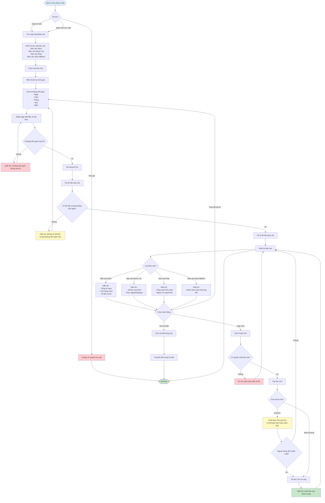

# Feature 2.7.2: Báo Cáo Chi Tiết (Detailed Reports)

## Mô tả
Tính năng cho phép quản lý viên và nhân viên thư viện xem và xuất các báo cáo chi tiết.

## Actor
Quản lý viên, Nhân viên thư viện

## Phụ thuộc
- 2.1.2 (Cần đăng nhập)
- 2.7.1 (Cần có dashboard và dữ liệu đầy đủ)

## Flowchart

## Các báo cáo có sẵn
1. **Báo cáo Sách:** Tổng số sách, tình trạng, số lần mượn
2. **Báo cáo Mượn Trả:** Số lần mượn/trả theo ngày/tháng/quý
3. **Báo cáo Phạt:** Tổng doanh thu phạt, người nợ ngoài hạn
4. **Báo cáo Sách Mất/Hư:** Danh sách sách cần thay thế

## Tính năng
- Xuất báo cáo ra CSV
- Lọc theo khoảng thời gian (Ngày, Tuần, Tháng, Quý, Năm)

## Edge Cases
- Khoảng thời gian không hợp lệ → Validation và thông báo lỗi
- File CSV quá lớn → Có thể giới hạn hoặc cảnh báo
- Không có quyền xuất báo cáo → Ẩn nút xuất
- Không có dữ liệu trong khoảng thời gian → Hiển thị thông báo
- Lỗi khi xuất file → Hiển thị thông báo lỗi

