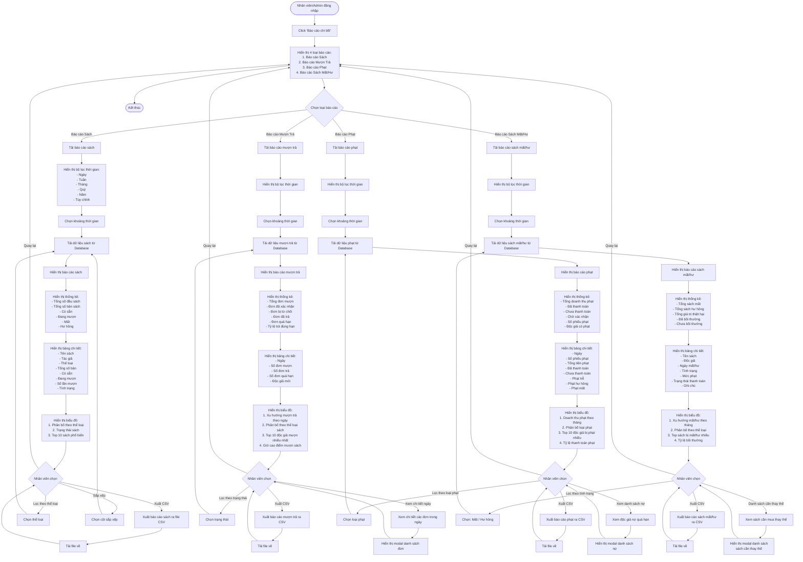

# Feature 2.7.2: Báo Cáo Chi Tiết

## Mô tả
Cung cấp các báo cáo chi tiết về sách, mượn trả, phạt và sách mất/hư. Hỗ trợ lọc theo thời gian và xuất file CSV.

## Actor
Quản lý viên, Nhân viên thư viện

## Yêu cầu
- Đã đăng nhập (Feature 2.1.2)
- Có vai trò Librarian hoặc Admin
- Có dashboard tổng quan (Feature 2.7.1)

## Flowchart



## Display Information

### 1. Báo Cáo Sách
```json
{
  "summary": {
    "total_titles": "number",
    "total_copies": "number",
    "available": "number",
    "borrowed": "number",
    "lost": "number",
    "damaged": "number"
  },
  "by_category": [
    {
      "category": "string",
      "count": "number",
      "percentage": "number"
    }
  ],
  "top_books": [
    {
      "title": "string",
      "borrow_count": "number",
      "rating": "number"
    }
  ]
}
```

### 2. Báo Cáo Mượn Trả
```json
{
  "summary": {
    "total_borrows": "number",
    "confirmed": "number",
    "rejected": "number",
    "returned": "number",
    "overdue": "number",
    "on_time_rate": "number (%)"
  },
  "by_date": [
    {
      "date": "date",
      "borrows": "number",
      "returns": "number",
      "overdue": "number"
    }
  ],
  "top_borrowers": [
    {
      "reader_name": "string",
      "total_borrows": "number"
    }
  ],
  "peak_hours": [
    {
      "hour": "number (0-23)",
      "count": "number"
    }
  ]
}
```

### 3. Báo Cáo Phạt
```json
{
  "summary": {
    "total_revenue": "number (VND)",
    "paid": "number (VND)",
    "unpaid": "number (VND)",
    "pending": "number (VND)",
    "total_fines": "number",
    "readers_with_fines": "number"
  },
  "by_type": {
    "late_return": "number (VND)",
    "damaged": "number (VND)",
    "lost": "number (VND)"
  },
  "by_month": [
    {
      "month": "string (YYYY-MM)",
      "total": "number (VND)",
      "paid": "number (VND)"
    }
  ],
  "top_fined_readers": [
    {
      "reader_name": "string",
      "total_fines": "number (VND)",
      "unpaid": "number (VND)"
    }
  ]
}
```

### 4. Báo Cáo Sách Mất/Hư
```json
{
  "summary": {
    "total_lost": "number",
    "total_damaged": "number",
    "total_value": "number (VND)",
    "compensated": "number (VND)",
    "not_compensated": "number (VND)"
  },
  "items": [
    {
      "book_title": "string",
      "reader_name": "string",
      "date": "date",
      "condition": "Mất | Hư hỏng",
      "fine_amount": "number (VND)",
      "payment_status": "string",
      "note": "string"
    }
  ],
  "by_category": [
    {
      "category": "string",
      "lost_count": "number",
      "damaged_count": "number"
    }
  ],
  "replacement_needed": [
    {
      "book_title": "string",
      "copies_lost": "number",
      "priority": "High | Medium | Low"
    }
  ]
}
```

## Date Range Filters

| Filter | Description |
|--------|-------------|
| Hôm nay | Dữ liệu trong ngày |
| Tuần này | 7 ngày gần nhất |
| Tháng này | Tháng hiện tại |
| Quý này | Quý hiện tại (3 tháng) |
| Năm này | Năm hiện tại |
| Tùy chỉnh | Chọn ngày bắt đầu & kết thúc |

## Export CSV Format

### Book Report CSV
```csv
Tên Sách,Tác Giả,Thể Loại,Tổng Số Bản,Có Sẵn,Đang Mượn,Số Lần Mượn,Tình Trạng
"Lập trình Python","Nguyễn Văn A","Công nghệ",10,7,3,25,"Tốt"
```

### Borrow/Return Report CSV
```csv
Ngày,Số Đơn Mượn,Số Đơn Trả,Số Đơn Quá Hạn,Độc Giả Mới
"2024-01-15",12,8,2,3
```

### Fine Report CSV
```csv
Ngày,Số Phiếu Phạt,Tổng Tiền,Đã Thanh Toán,Chưa Thanh Toán,Phạt Trễ,Phạt Hư Hỏng,Phạt Mất
"2024-01-15",5,250000,150000,100000,100000,50000,100000
```

### Damage Report CSV
```csv
Tên Sách,Độc Giả,Ngày,Tình Trạng,Mức Phạt,Trạng Thái Thanh Toán,Ghi Chú
"Clean Code","Trần Văn B","2024-01-15","Mất",300000,"Đã thanh toán","Mất hoàn toàn"
```

## UI Components

### Report Navigation Tabs
```
[📚 Báo cáo Sách] [📊 Mượn Trả] [💰 Phạt] [⚠️ Mất/Hư]
```

### Date Range Picker
```
┌────────────────────────────────────┐
│ Khoảng thời gian: [Tháng này ▼]  │
│ Từ: [__/__/____]  Đến: [__/__/____] │
│              [Áp dụng]             │
└────────────────────────────────────┘
```

### Export Button
```
[📥 Xuất CSV]
```

## Charts Library
- **Recharts** (React)
- Responsive design
- Interactive tooltips
- Legend
- Color coding

## Performance Optimization
- Pagination cho tables (50 rows/page)
- Lazy load charts
- Cache query results
- Index database cho report queries
- Background job cho export lớn

## Notes
- Tất cả báo cáo hỗ trợ xuất CSV
- Charts có thể zoom & pan
- Click vào data point → Chi tiết
- Responsive design
- Print-friendly layout
- Admin có thể schedule báo cáo tự động qua email (future)
- Có thể save custom report templates (future)
- Integration với Excel/Google Sheets (future)

