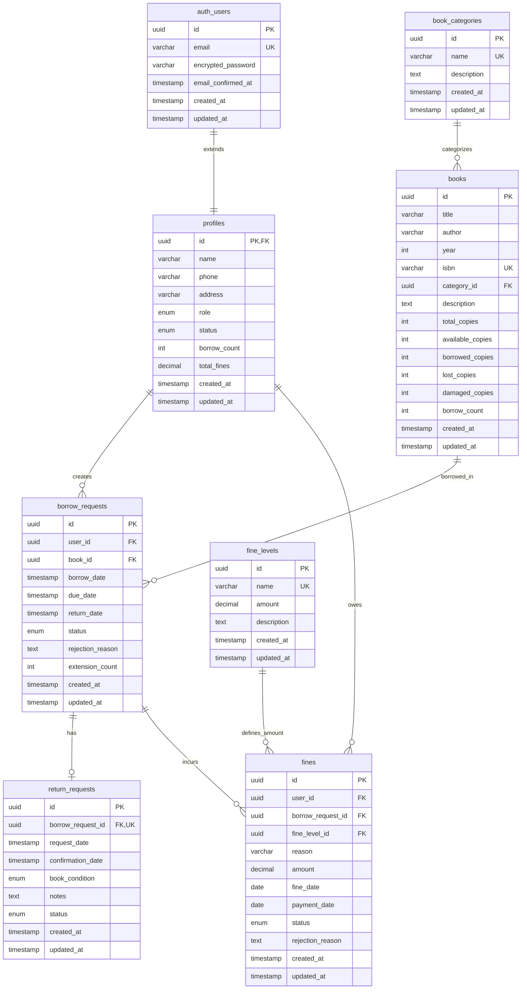

# Database Schema - Library Management System

## Entity Relationship Diagram

## Enums

### user_role
- `reader` - Can borrow books
- `librarian` - Can manage books and confirm transactions
- `admin` - Full system access

### user_status
- `active` - Account is active
- `disabled` - Account is disabled

### borrow_status
- `pending` - Waiting for librarian approval
- `approved` - Approved by librarian
- `rejected` - Rejected by librarian
- `borrowed` - Book is currently borrowed
- `returned` - Book has been returned
- `overdue` - Past due date

### return_status
- `pending` - Waiting for librarian confirmation
- `confirmed` - Return confirmed by librarian

### book_condition
- `normal` - Book in good condition
- `damaged` - Book is damaged
- `lost` - Book is lost

### fine_status
- `unpaid` - Fine not paid yet
- `pending_confirmation` - Payment submitted, waiting for confirmation
- `paid` - Fine has been paid
- `rejected` - Payment rejected by librarian

## Indexes

### Performance Indexes
- `idx_profiles_role` - Filter users by role
- `idx_profiles_status` - Filter users by status
- `idx_books_category_id` - Filter books by category
- `idx_books_borrow_count` - Sort books by popularity
- `idx_borrow_requests_user_id` - User's borrow history
- `idx_borrow_requests_book_id` - Book's borrow history
- `idx_borrow_requests_status` - Filter by status
- `idx_borrow_requests_due_date` - Find overdue books
- `idx_return_requests_borrow_request_id` - Link to borrow request
- `idx_return_requests_status` - Filter by status
- `idx_fines_user_id` - User's fines
- `idx_fines_status` - Filter fines by status

### Unique Indexes
- `idx_books_isbn` - Ensure unique ISBN
- `idx_book_categories_name` - Ensure unique category names
- `idx_fine_levels_name` - Ensure unique fine level names

## Business Rules

### Borrowing Rules
1. Maximum 5 books per reader at a time
2. Default borrow period: 14 days (max 30 days)
3. Maximum 1 extension per borrow (+7 days)
4. Cannot borrow if user has unpaid fines
5. Cannot borrow if book is not available

### Return Rules
1. One return request per borrow request
2. Fine calculation:
   - Overdue: Late days × late fee rate
   - Damaged: Damage fine level amount
   - Lost: Lost fine level amount

### Fine Rules
1. Fines created when:
   - Book returned damaged
   - Book returned lost
   - Book returned late
2. Reader must pay fines to continue borrowing
3. Payment requires librarian confirmation

## RLS Policies

### profiles
- **SELECT**: Users can view their own profile; Librarians/Admins can view all
- **UPDATE**: Users can update their own profile; Admins can update any
- **INSERT**: Handled by trigger on auth.users creation

### book_categories
- **SELECT**: Public (no authentication required)
- **INSERT/UPDATE/DELETE**: Librarians and Admins only

### books
- **SELECT**: Public (no authentication required)
- **INSERT/UPDATE/DELETE**: Librarians and Admins only

### borrow_requests
- **SELECT**: Users see their own; Librarians/Admins see all
- **INSERT**: Readers only (for themselves)
- **UPDATE**: Librarians/Admins only (status changes)

### return_requests
- **SELECT**: Users see their own; Librarians/Admins see all
- **INSERT**: Readers only (for their own borrow requests)
- **UPDATE**: Librarians only (confirmation)

### fine_levels
- **SELECT**: Public
- **INSERT/UPDATE/DELETE**: Admins only

### fines
- **SELECT**: Users see their own; Librarians/Admins see all
- **INSERT**: Librarians only (created on return confirmation)
- **UPDATE**: Readers (mark as pending_confirmation); Librarians (confirm/reject)
